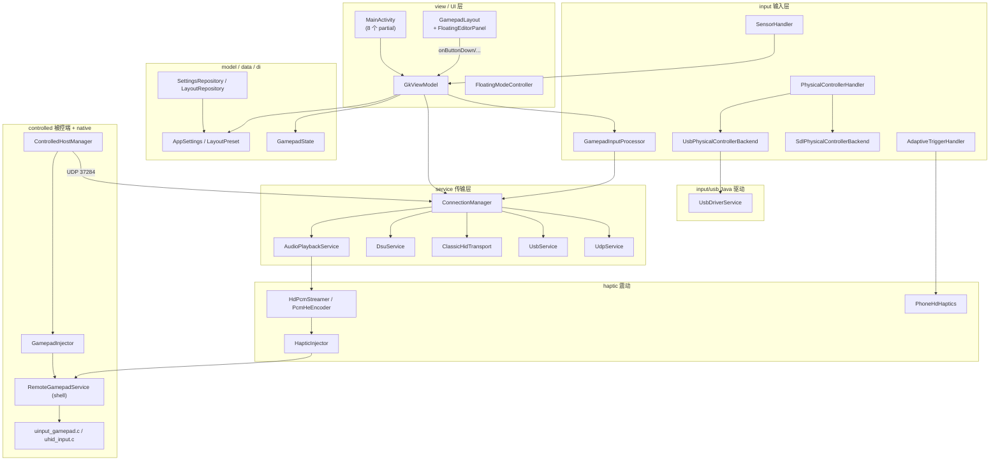

# GKME 开发者文档

> **G**amepad **K**eyboard **M**ouse **E**mulator / **G**eneral **K**ey **M**apping **E**ngine
>
> 本目录面向**二次开发与维护者**，描述 GKME 的内部架构、模块职责、数据流、协议与已知问题。
> 用户向说明见仓库根目录 [`README.md`](../README.md)。

---

## 1. 项目定位

GKME 是一个 Android 应用，把手机变成虚拟游戏手柄 / 键盘 / 鼠标，并把手机上的触摸与实体手柄输入发送到电脑
（或另一台手机）。支持的连接方式：

| 模式 | 角色 | 传输 |
|------|------|------|
| `WIFI` | 控制端 / 被控端 | UDP + protobuf（发现 + 业务），或 DSU/Emotion |
| `USB` | 控制端 | 经 `adb forward` 的 loopback TCP + protobuf |
| `BLUETOOTH` | 控制端 | Android `BluetoothHidDevice` 经典蓝牙 HID |
| `LOCAL` | 本机 | 不建网；经 Shizuku + uinput/uhid 在本机创建虚拟手柄 |

被控端（`CONTROLLED`）是 WiFi 模式下的反向角色：手机接收远端控制端的输入，并在本机创建虚拟手柄 / 键鼠。

---

## 2. 模块地图



---

## 3. 文档索引

| 文档 | 覆盖范围 |
|------|----------|
| [protocol.md](protocol.md) | protobuf 报文、UDP/USB 帧、发现握手、DSU、经典蓝牙 HID 报告、AIDL 接口 |
| [service-transport.md](service-transport.md) | `ConnectionManager` 及 `service/` 下 UDP/USB/蓝牙/DSU 传输、音频下行、状态机与重连 |
| [input.md](input.md) | 输入管线：`GamepadState`、触屏汇总、物理手柄（SDL/USB 两后端）、体感、自适应扳机、灵敏度曲线 |
| [usb-drivers.md](usb-drivers.md) | `input/usb/*.java`：各厂商手柄 USB HID 解析、DualSense 音圈 PCM、Switch HD rumble |
| [view-ui.md](view-ui.md) | `MainActivity` partial、`GkViewModel`、布局编辑/渲染/命中、`inputdispatcher` 策略层、外观、悬浮窗 |
| [haptic.md](haptic.md) | RichTap 手机 HD 震动、PCM→HE 流式管线、仲裁、native DualSense 音频触觉（实验细节见 [richtap-hd-vibration.md](richtap-hd-vibration.md)） |
| [controlled-native.md](controlled-native.md) | 被控端模式、Shizuku UserService 绑定、`GamepadInjector`/`HapticInjector`、uinput/uhid 原生虚拟 HID、HID 描述符 |
| [model-data.md](model-data.md) | 数据模型、`AppSettings`/`LayoutPreset`、DataStore 持久化、布局预设仓库、Hilt 注入 |
| [richtap-hd-vibration.md](richtap-hd-vibration.md) | （实验档案）通过 adb `app_process` 驱动线性马达、HE 格式逆向、真机标定记录 |
| [richtap/](richtap/README.md) | （实验附件）探针源码、脚本、HE 样例、反编译源码、框架 dump、逆向产物、预置效果表 |

---

## 4. 源码结构

```
android/src/main/
├── aidl/com/zyz4/gkme/controlled/    # IGamepadService.aidl、IHapticService.aidl
├── assets/richtap_prebaked.json     # RichTap 预置 HD 效果（HE 1.0）
├── cpp/                             # native：SDL 桥、uinput/uhid、DualSense 音频触觉
│   ├── sdl_bridge.cpp / sdl/include # libgkme_sdl
│   ├── haptic_native.c              # libgkme_sdl（DualSense isochronous）
│   ├── uinput_gamepad.c             # libgkme_uinput（uinput + 键鼠）
│   ├── uhid_input.c                 # libgkme_uinput（真实 HID 身份）
│   └── gkme_hid_descriptors.h       # HID report descriptor（自动生成）
├── java/com/zyz4/gkme/
│   ├── MainActivity*.kt             # 8 个 partial（外壳/外观/控件/编辑/订阅/映射/设置/USB）
│   ├── GkViewModel.kt               # 唯一 UI 状态中枢
│   ├── FloatingModeController.kt    # 悬浮窗模式
│   ├── data/                        # SettingsRepository / LayoutRepository / PairingStateRepository
│   ├── di/AppModule.kt              # Hilt 绑定
│   ├── haptic/                      # RichTap 引擎、HE 编解码、PCM 流
│   ├── input/                       # 输入处理 + SDL/USB 后端；input/usb/ 为 Java 驱动
│   ├── model/                       # AppSettings、LayoutPreset、GamepadState、外观模型
│   ├── service/                     # 连接、传输、音频
│   ├── view/                        # 自定义 View、布局、输入分发策略；view/inputdispatcher/
│   └── controlled/                  # 被控端 Activity/Service/Manager、Shizuku 代理
├── proto/gamepad_state.proto        # 协议定义
└── res/raw/                         # 内置布局预设：full_con / keyboard / mouse
```

---

## 5. 构建与测试

- 单一 Gradle 模块：`:android`（见 `settings.gradle.kts`）。
- Android `compileSdk/targetSdk = 36`，`minSdk = 26`，Kotlin/Java 17。
- 依赖：Hilt、DataStore、Gson、protobuf-javalite、Shizuku API、SDL3 AAR（`android/libs/`）。
- native 由 CMake 构建，产出 `libgkme_sdl.so` 与 `libgkme_uinput.so`。
- 单元测试位于 `android/src/test/`，当前覆盖纯 JVM 逻辑：RichTap 编解码、PCM 编码、仲裁、
  Curves/Accel、自适应扳机、DualSense 输出报文、HD rumble 编码、音频 DSP 等。

```bash
./gradlew :android:assembleDebug      # 构建
./gradlew :android:testDebugUnitTest  # JVM 单元测试
```

---

## 6. 核心术语表

| 术语 | 含义 |
|------|------|
| **控制端 / Controller** | 手机作为输入源，把输入发给电脑 |
| **被控端 / Controlled** | 手机接收远端输入并在本地创建虚拟手柄 |
| **本机模式 / LOCAL** | 手机自己既当控制端又当被控端，经 Shizuku 创建虚拟手柄 |
| **HE / Hed** | RichTap 动态效果的 JSON 描述（Haptic Effect）；设备只认 HE 1.0 |
| **LRA** | 线性谐振致动器，手机马达；窄带（约 87–225 Hz） |
| **DSU** | Cemuhook/Dolphin 的 UDP 手柄协议（Emotion 兼容） |
| **uinput / uhid** | Linux 两种虚拟输入设备路径；uhid 使用真实 HID 描述符伪装手柄 |
| **Shizuku** | 以 shell/root 身份运行 UserService，绕过 hidden API 限制 |
| **物理手柄 / Physical controller** | 经 OTG/蓝牙接入的实体手柄，经 SDL3 或 Axixi2233 USB 驱动读取 |
| **SDL3 backend / USB backend** | 物理手柄的两条接入栈，二选一，接口一致（`PhysicalControllerBackend`） |

---

## 7. 阅读建议

- 想了解**数据如何从触摸走到网络**：先看 [view-ui.md](view-ui.md) 的输入汇总，再看 [protocol.md](protocol.md)
  与 [service-transport.md](service-transport.md)。
- 想了解**物理手柄**：先看 [input.md](input.md) 的 backend 抽象，再看 [usb-drivers.md](usb-drivers.md)。
- 想了解**震动**：先看 [haptic.md](haptic.md)，再做真机实验时查 [richtap-hd-vibration.md](richtap-hd-vibration.md)。
- 想了解**被控端 / Shizuku**：看 [controlled-native.md](controlled-native.md)。
