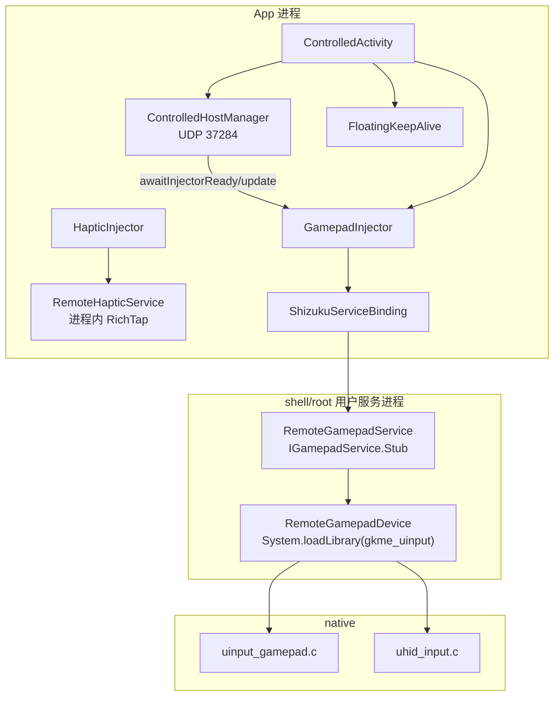

# 被控端与原生虚拟 HID（controlled / cpp）

> 覆盖 `android/src/main/java/com/zyz4/gkme/controlled/`、`cpp/uinput_gamepad.c`、`cpp/uhid_input.c`、
> `cpp/gkme_hid_descriptors.h`、`aidl/com/zyz4/gkme/controlled/*.aidl`、`AndroidManifest.xml`。
>
> 本模块让手机在没有电脑的情况下创建**本地虚拟手柄**（本机模式），或作为**被控端**接收远端输入后
> 创建本地虚拟手柄 / 键鼠。核心依赖 Shizuku 以 shell/root 身份运行用户服务，直接操作
> `/dev/uinput` 与 `/dev/uhid`。

---

## 1. 总览

- **手柄用户服务走 Shizuku**：`IGamepadService` 由 Shizuku 以 shell/root 身份运行并维护 binder；
  Shizuku 权限为应用级一次授权。
- **震动不再依赖 Shizuku**：`HapticInjector` 在 app 进程内直接实例化普通 Kotlin 类
  `RemoteHapticService` 反射调用 RichTap hidden API（前台 uid），不再有 AIDL 接口/用户服务。
- **保活不再依赖 Shizuku**：被控端采用可选的「悬浮窗保活」（[FloatingKeepAlive]，见 §3.4）。
- **两条原生路径**：uinput（伪装 Xbox One S，Linux FF 震动）与 uhid（真实 HID 身份 + HID 键鼠）。

---

## 2. Shizuku UserService 绑定

### 2.1 通用绑定器 ShizukuServiceBinding

`controlled/ShizukuServiceBinding.kt`。与业务解耦的“授权 + 绑定”封装。

构造参数：`tag / processNameSuffix / serviceClass / onConnected / onDisconnected`。

- **应用级权限共享（`ShizukuPermission`）**：Shizuku 权限按 uid 授予，与具体用户服务无关，
   因此授权状态集中在同文件的 `internal object ShizukuPermission`，所有 binding 读同一份，
   避免重复缓存 `permissionGranted` 而出现「显示已授权但操作被拒」
  或「显示已授权但操作被拒」。`requestCode`（`0x5A17`）与 `autoPrompted` / `requestInFlight`
  也在此统一管理，保证同一时刻只真正申请一次、被拒后不重复弹窗。
- **不做粘滞缓存**：`ShizukuPermission.refresh(force)` 以服务端真实返回值刷新（仅按 1s 节流），
  绑定前、授权结果回调后与 `requiredAction()` 展示前都会刷新；绑定抛 `SecurityException` /
  `IllegalStateException` 时调用 `invalidate()` 作废缓存，使界面重新提示「申请授权」。
- 状态：`binderAlive`、`permissionGranted`、`permissionDenied`、`bound`、`lastError`。
- init：
  1. 主线程 `Handler`；
   2. `Shizuku.UserServiceArgs(ComponentName(app.packageName, serviceClass.name))`，设置
      `daemon(...)`（构造参数，默认 `false`）、`processNameSuffix`、
      `debuggable(false)`、`version(1)`、`tag`；
  3. 注册 `addBinderReceivedListenerSticky`、`addBinderDeadListener`、`addRequestPermissionResultListener`。
- `requestPermission(force)`：主线程执行；先 `ShizukuPermission.refresh(force=true)`，已授权则 `ensureBound`；
  `requestInFlight` 防重入；`autoPrompted && !force` 时不再弹窗（避免反复弹窗）；`force` 清除 `denied`。
- `ensureBound`：`!binderAlive` 返回；`refresh()` 复核授权（缓存为 true 也复核），未授权则申请；否则
  `Shizuku.bindUserService(args, connection)`；捕获权限类异常后 `ShizukuPermission.invalidate()`。
  - **自愈重试**：`bound` 表示「已 `onServiceConnected`」而非「已发出绑定请求」；绑定请求在途时按
    `BIND_RETRY_INTERVAL_MS`(5s) 超时重发。因为 Shizuku 服务端启动用户服务失败/超时会直接移除记录，
    **不会回调 `onServiceDisconnected`**（`RemoteCallbackList.kill()` 不触发 `died()`），若不重发会永久
    卡在 `bound=false`、`service=null`，表现为「已授权但操作无法完成」。
- `connection`：`onServiceConnected → bound=true + onConnected(binder)`；`onServiceDisconnected → bound=false + onDisconnected()`。
- `detach`：移除监听并 `unbind`（不清空共享权限状态，避免影响其它仍在运行的 binding）。
- 常量：`SHIZUKU_PACKAGE = "moe.shizuku.privileged.api"`；`requiredAction` 依据
  「未安装→DOWNLOAD / binder 未活→OPEN / 未授权→REQUEST_PERMISSION / 否则 NONE」。

### 2.2 AIDL 实现与退出

- `RemoteGamepadService : IGamepadService.Stub()`。
- `RemoteGamepadService` 由 Shizuku 以 shell/root 用户服务运行，支持带 `Context` 的构造器（Shizuku v13 优先）；
  `RemoteHapticService` 已改为普通 Kotlin 类，由 `HapticInjector` 在 app 进程内直接实例化，同样带 `Context` 构造器。
- App 通过 `Stub.asInterface(binder)` 拿手柄用户服务代理；震动为进程内直接调用。
- 退出事务 `exitService() = 16777114`（实际事务号 16777115）；手柄用户服务的 `exitService()` 会先
  `release()/stop()` 再 `Process.killProcess(Process.myPid())`，因为 Shizuku 不会自动杀用户服务进程。
- 接口细节见 [protocol.md §7](protocol.md#7-aidl-接口被控端--本机模式)。

### 2.3 绑定参数

| 封装 | 进程后缀 | 服务类 | daemon |
|------|----------|--------|--------|
| `GamepadInjector` | `gkme_remote_input` | `RemoteGamepadService` | false |

只有手柄走 `ShizukuServiceBinding`；绑定参数不再携带 requestCode，`daemon` 由
`ShizukuServiceBinding` 构造参数控制（当前为默认 `false`）。

---

## 3. GamepadInjector 与 HapticInjector

### 3.1 GamepadInjector

`controlled/GamepadInjector.kt`。object，持有 `service: IGamepadService?`、`created`、`lastError` 及当前配置。

- `ensureReady(rumble, mouse, backendId, profileId)` 是核心状态机：
  1. `binding==null || !binderAlive` → `lastError="Shizuku 未运行"`，false；
  2. `!permissionGranted` → 写 lastError、`requestPermission()`，false；
  3. `service==null` → `lastError="正在启动 Shizuku 用户服务…"`、`ensureBound()`，false；
  4. 配置全一致且 `created` → true；
  5. 配置变化 → `release()` 后按新配置重建；
  6. `svc.create(backend, profile, rumble)`，0 视为成功。
- `configure(backend, profile)`：设置变化时同步；若已创建则释放并立即重建。
- `update` 转发：`svc.update(toXInputButtons, LT, RT, LSX, LSY, RSX, RSY, gyro, accel, buildTouches)`
  + `updateKeyboard` + `updateMouse`。
- **键盘/鼠标懒创建与一次性失败标记**：仅在有输入时创建；失败置 `keyboardFailed/mouseFailed`，
  本会话不再重试；断连/释放时 `resetKeyboardMouse()` 清标记。
- `toXInputButtons`：GKME 位 → XInput wButtons（触摸板点击用保留位 `0x20000`，十字键写低 4 位）。
- `buildTouches`：最多 2 点 × `[id,x,y,active]`，x 0..1919、y 0..942。
- `pumpRumble`：返回 long（高 16 位左、低 16 位右）。
- `setCreated`：维护 `VirtualGamepad.virtualGamepadActive` 与 `SdlNative.nativeSetVirtualGamepadExclusion`。
- `statusText`：按 binder/授权/service/lastError/created 顺序给出用户可读状态。
- **降级**：Shizuku 未运行/未授权/服务未起 → false，由调用方轮询重试；原生库加载失败返回 `-19`（-ENODEV）；
  打开 `/dev/uinput` 或 `/dev/uhid` 失败返回负 errno。

### 3.2 HapticInjector

`controlled/HapticInjector.kt`。见 [haptic.md §3.2](haptic.md#32-hapticinjector)。

- 在 app 进程内直接实例化 `RemoteHapticService`，不经 Shizuku 授权/绑定。
- 能力查询回退：每个后加能力都 try/catch 兼容。
- 内嵌 `HapticArbiter`；`startEffect` 在实现无该通路时回退 `startPattern`。
- `isHapticReady()` 不满足时，调用方回退系统 `Vibrator`。

### 3.3 用户服务侧实现

- `RemoteGamepadService`：`AtomicInteger fd/kbdFd/mouseFd` + 单一 `lock`；`update/updateKeyboard/updateMouse`
  读 fd 后直接调 native。
- 后端分派：`backend==BACKEND_UHID(1)` 走 `native*Uhid`，否则走 uinput 版本。
- `release()` 先 `releaseKeyboardMouse()` 再销毁手柄。
- `RemoteHapticService`：`tryInitType2()` 失败才 `tryInitType1()`。

### 3.4 FloatingKeepAlive（悬浮窗保活）

**保活**：WiFi 被控端在熄屏/后台时可能被系统 Doze、待机桶或电池优化限制网络与唤醒；
国产 ROM（MIUI/HyperOS、EMUI、ColorOS 等）另有各自的内存/耗电杀后台策略。

- `controlled/FloatingKeepAlive.kt`。object，通过 [WindowManager] 在屏幕上挂一个 **1×1 像素、
  完全透明且不可触摸**的悬浮窗（`TYPE_APPLICATION_OVERLAY`，flags 为
  `NOT_FOCUSABLE | NOT_TOUCHABLE | NOT_TOUCH_MODAL`）。只要本进程持有一个系统级悬浮窗，
  系统就会把它视为“有可见窗口”的进程，从而降低后台/熄屏被回收的概率。
- `start(context)` / `stop()` 均把 `addView` / `removeView` post 到主线程执行；重复调用幂等。
- 依赖 `SYSTEM_ALERT_WINDOW` 权限：`canDrawOverlays(context)` 为 false 时 `start` 直接跳过，
  由 [ControlledActivity] 引导用户跳转系统「显示在其他应用上层」设置页。
- **不强制**：是否启用由设置项 `floatingKeepAlive`（默认关闭）控制，界面上的「悬浮窗保活」
  开关负责切换；`ControlledHostService` 订阅 `ConnectionManager.settings`，设置或进程重建后
  自动恢复悬浮窗。

> 旧版基于 Shizuku daemon 的「Doze 白名单 + 复活看门狗」保活已移除：它依赖 Shizuku 存活，
> 且无法对抗系统「强制停止」，实际效果有限。

---

## 4. ControlledHostManager 与 ControlledHostService

### 4.1 ControlledHostManager

`controlled/ControlledHostManager.kt`。object，被控端主机：监听 GKME 协议、发现控制端、接收输入并注入本地手柄。

- 常量：`PORT=37284`、广播前缀 `"GKME|"`、包类型 `0x00/0x01/0x02`、设备超时 15s、输入超时 3s、
  UDP 缓冲 4MB。
- `Phase`：`IDLE/STARTING/LISTENING/CONNECTING/CONNECTED/RECONNECTING/ERROR`。
- `start()`：创建 `SupervisorJob+Dispatchers.IO` scope，`bindSockets()`，启动 `pruneLoop`/`watchdogLoop`。
- `bindSockets`：对每个本机 IP 绑 `DatagramSocket(PORT, ip)`；全部失败回退通配地址；`BindException`
  置 `portInUse`。
- `receiveLoop`：匹配 `"GKME|"` 前缀 → `handleBroadcast`；否则按首字节类型分派。
- 发现/握手：`handleBroadcast` 拆出 name/mac；`handleClientToServer` 解析 `Hello`；
  若来自 active 则 `recoverFromReconnect`。
- `connect(device)`：取消旧任务、断开当前、`awaitInjectorReady(8s)`、设 active、`sendServerHello`、
  `startRumblePump`、置 CONNECTED。
- `awaitInjectorReady`：每 250ms 轮询 `GamepadInjector.ensureReady()`。
- `handleGamepadInput`：仅接受 active IP；`reconnecting || !isReady()` 时只保活不注入；否则
  `GamepadInjector.update(input)`。
- `pruneLoop`：剔除 15s 无广播的非 active 设备，每秒刷新 Shizuku 状态。
- `watchdogLoop`：active 且 >3s 未收包 → `reconnecting=true`、`release()`（避免按键卡住），
  但保留 session/active。
- `startRumblePump`：每 8ms `pumpRumble()`；变化立即发，否则每 500ms 保活；换算为 0..255 的
  `CompactFrame.Vibration` 下发。
- `ServerHello`：protocol=1、hostName=Build.MODEL、maxDownlinkRateHz=1000、recommendedUplinkIntervalUs=0。
- `publish`：按 `groupKey`（MAC，未知退回 IP）分组，同一物理设备多 IP 合并为一张卡。
- `disconnectInternal`：向对端发 `Disconnect(reason)`。

### 4.2 ControlledHostService

`controlled/ControlledHostService.kt`。前台常驻服务，防止熄屏/后台被杀。

- `ACTION_STOP="com.zyz4.gkme.action.STOP_CONTROLLED"`、`CHANNEL_ID="controlled_mode"`、
  `NOTIFICATION_ID=4102`。
- `start/stop` 用 `ContextCompat.startForegroundService` / `stopService`；`onBind` 返回 null。
- `onStartCommand`：STOP 则 `stopSelf()`；否则 `startForeground`，兜底 `GamepadInjector.init/ensureBound`、
  `ControlledHostManager.start()` 与 `FloatingKeepAlive`（订阅 `ConnectionManager.settings`，
  开关开启时挂悬浮窗）；`START_STICKY`。服务为 `@AndroidEntryPoint`，注入 `ConnectionManager`。
- `onDestroy`：取消通知/保活任务、`FloatingKeepAlive.stop()`、`ControlledHostManager.stop()`。
- 通知收集 `ControlledHostManager.state` 刷新常驻通知（`IMPORTANCE_LOW`），含“停止” action 与
  点击回 `ControlledActivity`。

### 4.3 ControlledActivity / ControlledDevice / ControlledDeviceCard

- `ControlledActivity`：初始化并绑定 injector、「悬浮窗保活」开关（缺权限时跳转系统设置并
  在 `onResume` 补挂窗口）、启动前台服务、虚拟手柄类型选择器、订阅 Flow；退出确认框后停服务。
- `ControlledDevice`：单 IP 端点，`groupKey=mac 否则 ip`。
- `ControlledDeviceCard`：同 MAC 多 IP 合并，`hasMultipleEndpoints` 决定是否展开。

---

## 5. 原生虚拟 HID

### 5.1 两条路径对比

| 维度 | uinput | uhid |
|------|--------|------|
| 设备节点 | `/dev/uinput` | `/dev/uhid` |
| 总线/身份 | `BUS_VIRTUAL` + `0x045E:0x02FD`，名 `Xbox One S Controller` | `BUS_USB` + 真实厂商/产品 |
| 描述符 | 无，直接 Linux input 事件 | `gkme_hid_descriptors.h` 真实 HID report descriptor |
| 报告 | 11 EV_KEY + 8 EV_ABS + 1 EV_SYN | 各 profile 的 64 字节 HID 报告 |
| 震动回读 | Linux FF（upload/erase/EV_FF） | 解析 output report |
| 支持身份 | Xbox One S、GKME 键盘/鼠标 | DS4 / DualSense / Switch Pro、HID 键鼠 |
| 库 | `libgkme_uinput.so` | 同上 |

由 `VirtualGamepadType`（`model/AppSettings.kt:19-30`）的 `nativeBackend`/`uhidProfileId` 选择。

### 5.2 uinput 路径（`cpp/uinput_gamepad.c`）

- **ioctl 常量自造**，避免依赖 NDK 头版本；`struct gkme_*` 与内核 ABI 对齐。
- **Xbox One S 伪装**：`bustype=0x0006`、`vendor=0x045E`、`product=0x02FD`、名 `"Xbox One S Controller"`
  （名称是 App 排除自建虚拟手柄的依据，需与 `VirtualGamepad.kt`/`sdl_bridge.cpp` 一致）。
- 手柄能力：11 按键码 + 8 轴（左/右摇杆 ±32767、扳机 0..255、十字键 -1..1）。
- 按键/轴打包：`g_key_masks` → `g_key_codes`；十字键由 buttons 低 4 位算 hat。
- **FF 能力始终暴露**：EV_FF/FF_RUMBLE/FF_GAIN 恒注册，由 `rumble_enabled` 决定是否回传数据。
- 震动回读线程 `gkme_ff_thread`：`read input_event`，处理 `EV_UINPUT` 的 FF_UPLOAD/FF_ERASE 与 `EV_FF`；
  `gkme_recompute_rumble` 遍历最多 16 个 effect（`GKME_MAX_FF=16`），取 `strong/weak_magnitude` 最大值。
- `nativeRumble` 返回 `left<<16 | right`。
- **虚拟键盘**：`0x045E:0x00B0`、名 `"GKME Remote Keyboard"`；EV_KEY + EV_REP；
  `nativeWriteKeyboard` 为“全量状态 + 只写变化”。
- **虚拟鼠标**：`0x045E:0x00B1`、名 `"GKME Remote Mouse"`；5 键 + 6 相对轴；
  滚轮双路输出：高精度 `REL_WHEEL_HI_RES`（协议 120/格 → 系统 30/格，余量累加）与传统 `REL_WHEEL`。

### 5.3 uhid 路径（`cpp/uhid_input.c`）

- 协议结构 `gkme_uhid_*` 均 `__attribute__((packed))`；`GKME_UHID_DATA_MAX=4096`。
- 设备种类：DS4=1、DualSense=2、Switch Pro=3、Keyboard=10、Mouse=11。
- **身份伪装**：DS4 `0x054C:0x09CC`、DualSense `0x054C:0x0CE6`、Switch Pro `0x057E:0x2009`。
- 创建走 `gkme_uk_create`（`open("/dev/uhid")` + `CREATE2`），起 `reader` 线程；
  仅 Switch Pro 额外起 `streamer` 线程（每 15000us 发 0x30 帧）。
- **报告格式**：
  - DS4：64 字节，`rpt[0]=0x01`；hat/face 在 `rpt[5]`，肩键在 `rpt[6]`，Guide/触摸板在 `rpt[7]`，
    LT/RT 在 `rpt[8..9]`，IMU 在 `13..24`，触摸从 `rpt[33]` 起。
  - DualSense：64 字节，`rpt[0]=0x01`；IMU 在 `16..27`，触摸从 `rpt[33]` 起（y 按 1080/943 缩放）。
  - Switch Pro：`frame[0]=0x30`、`frame[1]=timer`、`frame[2]=0x91`、`frame[12]=0xB0`；
    12 位 nibble 打包摇杆 + 3 组 IMU。
- **Feature 应答** `gkme_build_feature`：DS4/DualSense 的校准/固件/MAC；键盘/鼠标 `rnum==0` 时返回
  `{0x01}`（鼠标 Resolution Multiplier 必须回有效值，否则内核写 feature 可能阻塞）。
- **Output（震动回读）** `gkme_handle_output`：`rumble_enabled==0` 直接忽略（避免回环）；
  DS4 rid 0x05、DualSense rid 0x02、Switch rid 0x01/0x10。
- **Switch 专有协议**：`gkme_switch_proprietary`（0x01/0x02/0x03）与 `gkme_switch_subcommand`
  （0x02/0x03/0x04/0x10/0x21/0x40/0x48）；`gkme_switch_spi_byte` 镜像校准数据。
- **线程**：`gkme_uk_reader`（poll 200ms + read，处理 STOP/GET_REPORT/SET_REPORT/OUTPUT）；
  `gkme_uk_streamer`（仅 Switch Pro）。
- `nativeWriteUhid` 在 `dev->lock` 内更新 gyro/accel/touch 并打包，解锁后发送。
- 键鼠：`nativeWriteKeyboardUhid` 写 34 字节（modifier + 保留 + 256 位位图）；
  `nativeWriteMouseUhid` 写 9 字节。

### 5.4 HID 描述符（`cpp/gkme_hid_descriptors.h`）

文件头注明「Auto-generated from GKMD StaticProfileRegistry.cs. Do not edit.」。5 个描述符：

| 描述符 | 长度 | 对应报告 |
|--------|------|----------|
| `GKMD_DESC_DS4` | 507B | `gkme_pack_ds4` 64B；feature 0x02/0x81/0x20/0xA3 |
| `GKMD_DESC_DUALSENSE` | 273B | `gkme_pack_dualsense`；feature 0x05/0x09/0x20/0x22 |
| `GKMD_DESC_SWITCH_PRO` | 203B | `gkme_switch_build_frame` 0x30 帧 |
| `GKMD_DESC_KEYBOARD` | 68B | 标准 Boot Keyboard，报告 34B |
| `GKMD_DESC_MOUSE` | 119B | HID Mouse，报告 9B |

这些描述符与 `nativeWrite*Uhid` 的字节布局、`gkme_build_feature` 的 feature 长度严格对应，
是 uhid 路径被内核 `hid-playstation`/`hid-nintendo` 正确枚举的关键。

---

## 6. AndroidManifest 相关声明

- **权限**：`INTERNET`、`ACCESS_NETWORK_STATE`、`BLUETOOTH*`、`VIBRATE`、`SYSTEM_ALERT_WINDOW`、
  `FOREGROUND_SERVICE`、`FOREGROUND_SERVICE_SPECIAL_USE`、`POST_NOTIFICATIONS`、
  `moe.shizuku.manager.permission.API_V23`。
- **uses-feature**：gyroscope、BLE、USB host，均 `required=false`。
- **queries**：`moe.shizuku.privileged.api`。
- **Activity**：`.MainActivity`（launcher，landscape）、`.controlled.ControlledActivity`（exported=false）。
- **Service**：`.input.usb.UsbDriverService`、`.service.FloatingOverlayService`（specialUse:
  `floating_gamepad_overlay`）、`.controlled.ControlledHostService`（specialUse: `controlled_host_keepalive`）。
- **Provider**：`.GkmeShizukuProvider`（承继 `rikka.shizuku.ShizukuProvider`），authority
  `${applicationId}.shizuku`，permission `INTERACT_ACROSS_USERS_FULL`。子类仅把 `call` 加
  `@Synchronized`，串行化 Shizuku 服务端并发的 binder 下发，规避库内 `onBinderReceived` 竞态
  （见 §8）。

---

## 7. 关键常量

| 项 | 值 |
|----|----|
| UDP 端口 | 37284 |
| 广播前缀 | `GKME|` |
| 包类型 | 0x00 C2S / 0x01 S2C / 0x02 GamepadInput |
| 设备超时 / 输入超时 | 15s / 3s |
| Shizuku 包名 | `moe.shizuku.privileged.api` |
| Shizuku 权限 requestCode（全局共享） | `0x5A17` |
| 用户服务进程后缀 | `gkme_remote_input` |
| 退出事务号 | 16777114 |
| 原生库名 | `gkme_uinput` |
| 通知 id / 渠道 | 4102 / `controlled_mode` |
| uinput 身份 | `0x045E:0x02FD` Xbox One S |
| uhid 身份 | DS4 `0x054C:0x09CC`、DS5 `0x054C:0x0CE6`、Switch `0x057E:0x2009` |
| FF 上限 | `GKME_MAX_FF=16` |
| 滚轮换算 | 协议 120/格 → 系统 30/格（高精度） |
| 实时调参门槛 | RichTap core 主版本 ≥ 32 |

---

## 8. 已知问题 / 注意事项

| 问题 | 证据 |
|------|------|
| `ensureReady` 默认 `rumble=true, mouse=true`；仅本机模式显式关闭，改动需留意 | `GamepadInjector.kt:141-146`；`MainActivitySettings.kt:1668` |
| [已修复] 震动数值范围注释不一致（AIDL/注释已统一为 0..65535） | `IGamepadService.aidl:27`；`ControlledHostManager.kt:483-484` |
| `configure()` 重建沿用旧 `rumbleEnabled`，未重新同步 `mouseEnabled` | `GamepadInjector.kt:113` |
| [已修复] `swapVibrationIndex` 未接入设置（已删除未接线的字段） | `RemoteHapticService.kt:78-80` |
| `ensureReady` 自动流程只弹一次权限，拒绝后需用户手动 `force` | `ShizukuServiceBinding.kt`（`ShizukuPermission.autoPrompted`） |
| [已修复] 授权状态各自缓存导致「显示已授权但无法操作 / 显示未授权但 Shizuku 已授权」：改为 `ShizukuPermission` 应用级共享 + 每次绑定按服务端真实状态复核 + 权限异常作废缓存 | `ShizukuServiceBinding.kt`（`ShizukuPermission`） |
| [已修复] 启动时用户服务进程启动失败/超时导致「已授权但无法完成操作」：`bound` 改为以 `onServiceConnected` 为准，绑定请求按 5s 超时重发（服务端超时移除不回调 `onServiceDisconnected`） | `ShizukuServiceBinding.kt`（`BIND_RETRY_INTERVAL_MS`） |
| [已修复] 启动时 Shizuku 服务端并发下发 binder（同进程多线程），库内 `onBinderReceived` 未同步导致重复 `unlinkToDeath` 抛 `NoSuchElementException` 并回抛服务端：改用 `GkmeShizukuProvider` 串行化 `call`（升级到最新 13.1.5 仍在，属上游问题） | `GkmeShizukuProvider.kt`；`AndroidManifest.xml` |
| 设备上存在**两个 `shizuku_server` 实例**时，用户服务 token 建在一个 server、`attachUserService` 查另一个，报 `unable to find token`，两个用户服务全部连不上。App 无法选择 server，连续多次失败后置 `bindFailed` 并提示「Shizuku 服务状态异常，请重启手机后重试」；根治需重启 Shizuku/手机 | `ShizukuServiceBinding.kt`（`BIND_FAILED_MESSAGE`） |
| `VirtualGamepad` 仅含 4 个手柄身份，不含 GKME 键鼠；按 vendor/product 限定运行期排除 | `VirtualGamepad.kt:21-26` |
| [已修复] uinput Xbox 名称仅用于展示；运行期排除依据是 vendor/product，不依赖名称（文档已更正） | `uinput_gamepad.c:327-328`；`VirtualGamepad.kt:21-26` |
| [已修复] uhid 创建竞态：先起 reader 线程、后设 `rumble_enabled` | `uhid_input.c:798-803` |
| `last_report/last_len` 在 uhid 仅赋值未使用（预留） | `uhid_input.c:145-147,886-889` |
| [已修复] Watchdog 释放手柄并进入 RECONNECTING，保留会话等待 Hello 重建（设计如此，文档已更正） | `ControlledHostManager.kt:449-464` |
| 前台服务需 `PROPERTY_SPECIAL_USE_FGS_SUBTYPE`（Android 14+） | `AndroidManifest.xml:70-77` |
| 悬浮窗保活需 `SYSTEM_ALERT_WINDOW` 权限；未授权时开关开启无效，界面会引导授权 | `FloatingKeepAlive.kt`；`ControlledActivity.kt` |
| 悬浮窗保活无法对抗系统「强制停止」(force-stop)：被 force-stop 后进程与悬浮窗都不会存活 | `FloatingKeepAlive.kt` |
| 鼠标高精度 30 单位/格为实测值，不同 ROM 可能不同 | `uinput_gamepad.c:564-566` |
| uinput FF 能力恒暴露，本机/被控模式在系统里都显示为“带震动设备” | `uinput_gamepad.c:312-319` |

---

## 9. 相关文档

- AIDL 接口与协议：[protocol.md](protocol.md)
- HD 震动（进程内 RichTap）：[haptic.md](haptic.md)
- 物理手柄 USB 驱动（对照 uhid 伪装）：[usb-drivers.md](usb-drivers.md)
- 虚拟手柄类型设置持久化：[model-data.md](model-data.md)
