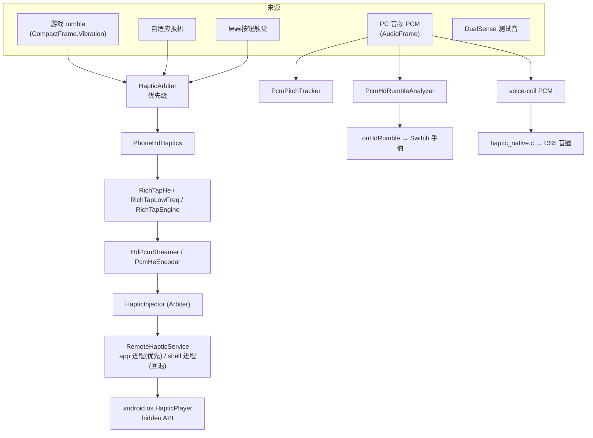

# 震动子系统（haptic）

> 覆盖 `android/src/main/java/com/zyz4/gkme/haptic/`、`controlled/HapticInjector.kt`、
> `controlled/RemoteHapticService.kt`、`service/PcmHdRumbleAnalyzer.kt`、`cpp/haptic_native.c`、
> `input/usb/HapticNative.java`、`input/usb/HdRumbleCodec.java`。
>
> 本文是**架构总览**。RichTap 的逆向细节、真机标定、实验记录见
> [richtap-hd-vibration.md](richtap-hd-vibration.md)（实验档案，长期保留）。

---

## 0. 三条互不相同的震动通路

震动子系统实际服务**三个不同的执行器**，容易混淆，先厘清：

| 通路 | 执行器 | 载体 | 相关代码 |
|------|--------|------|----------|
| **RichTap 手机 HD 震动** | 手机 LRA | HE 1.0 JSON → 反射 hidden API（**app 进程内**） | `haptic/*`、`HapticInjector`、`RemoteHapticService` |
| **DualSense USB 音频触觉** | DS5 语音线圈 | isochronous PCM（4ch/48k）→ native | `cpp/haptic_native.c`、`HapticNative.java`、`DualSenseHapticSender` |
| **Switch HD rumble** | Joy-Con / Pro 手柄 | Nintendo 专有线格式 | `HdRumbleCodec.java`、`PcmHdRumbleAnalyzer.kt`、`input/usb/*Controller` |



---

## 1. RichTap 引擎与 HE 编解码（纯 JVM）

这些文件均可 JVM 单测（`android/src/test/java/com/zyz4/gkme/haptic/`）。

### 1.1 RichTapEngine

`haptic/RichTapEngine.kt`。逆向自 RichTap 的映射核心。

- **强度律（次方律）**：`curveToAmplitude(c) = c · 1.14^(10(c-1))`，`c∈[0,1]`；
  逆变换 `amplitudeToCurve(a)` 用 40 次二分求根。`LAW_BASE=1.14`。
- **频率律**：`HE_HZ`（101 项）直接给出 HE 0..100 的**实测**机械频率（Hz）；`hzToHe` 求反，
  相邻重复值取最靠近谐振 HE 56 者。
  - 真机加速度计逐点标定（`manet`，LRA 与加速度计刚性耦合，fs≈486Hz 单条稳态效果）；
    HE>~82 处基频超过 Nyquist（≈243Hz），按 `f_true = fs − f_peak` 还原混叠，并与麦克风
    标定交叉验证。**取代**早期逆向自 `libaachaptics.so` 的线性表 `170·word/word(56)`——
    后者两端偏差大（HE0 实测 107Hz 而非 87Hz、HE100 实测 280Hz 而非饱和 225Hz）。
- **谐振与范围**：`HE_AT_RESONANCE=56`、`RESONANCE_HZ=169.1`（= `heToHz(56)`，使补偿在谐振处恰为 1）；
  有效范围 `MIN_HZ=107.2`、`MAX_HZ=280.3`。
- **幅度-频率补偿**：LRA 欠阻尼受迫振动位移响应归一化 `X(r)=2ζ/√((1-r²)²+(2ζr)²)`，
  补偿增益 `1/X` 封顶 `MAX_FREQ_COMPENSATION=2.0`，`MECHANICAL_Q=10.0`。
  `compensateNormalized` / `compensate255` 供各通路口径统一。

### 1.2 RichTapHe

`haptic/RichTapHe.kt`。HE 1.0 JSON 构造。

- 顶层 `Pattern`，每条曲线 `POINT_COUNT=4`。
- 约定：事件 `Parameters.Intensity∈0-100`、`Curve[].Intensity∈0-1`、`Frequency` 为偏移。
- `continuous(freq, dur)`、`click(strength, freq)`（用 40ms 短 continuous 模拟，真机 transient 得到空效果）、
  `curve(...)`、`pattern(events)`。
- 约束：单事件 `Duration≤5000ms`，最多 16 事件。

### 1.3 RichTapFrequency

`haptic/RichTapFrequency.kt`。

- `hzToHe` / `heToHz` 委托引擎；`hzToHeLog` 为对数刻度平滑外推。
- `shiftIntoRange(hz)`：按整数倍八度 `×2/÷2` 把任意 Hz 搬进有效范围，保留音高轮廓。

### 1.4 RichTapLowFreq

`haptic/RichTapLowFreq.kt`。目标频率低于下限时用**脉冲串**模拟低频。

- `MAX_PULSES=16`、`PULSE_RATIO=0.35`、`MIN_PULSE_MS=3`、`MIN_PERIOD_MS=4`。
- `supports(hz)` / `periodMs` / `pulseMs` / `pulseCount` / `coverageMs` / `pattern(...)`。
- 每个脉冲 4 点 `0 → 峰 → 0.35·峰 → 0`，峰值先补偿再 `amplitudeToCurve`。

### 1.5 RichTapPrebaked

`haptic/RichTapPrebaked.kt`。读取 asset `richtap_prebaked.json`，ID `10001..10050`。
数据源自 RichTap ASDK 2.2.0，已离线转为 HE 1.0。`load()` 幂等、线程安全；`he(id)` 未加载返回 null。

### 1.6 RichTapRawCodec + HeJson

`haptic/RichTapRawCodec.kt`：复刻 SDK `base.b.a(...)` 的 HE 1.0/HE 2.0 raw `int[]` 编码，
供 type2 `createPatternHeWithParam(int[])` 使用。

- 常量：`TAG_CONTINUOUS=4096`、`TAG_TRANSIENT=4097`、`DEFAULT_FREQUENCY=56`、`MAX_EVENTS=16`、
  `MAX_POINTS=16`、`POINT_SCALE=100.0`。
- `encode(...)` 按 core 版本分派 `encodeHe10`/`encodeHe20`；`swapId` 交换左右马达索引。

`haptic/HeJson.kt`：把 HE 1.0 JSON 解析为 `RichTapRawCodec.HeEvent`（`parseHe10`）。

### 1.7 HapticArbiter / HapticSource

- `HapticSource`：`BUTTON(0) < GAME_RUMBLE(1) < AUDIO(2) < ADAPTIVE_TRIGGER(3)`。
- `HapticArbiter`：`canPlay`（空闲或优先级≥当前）、`acquire`（可抢占/同级刷新）、`release`（仅当前来源）、
  `clear`。单 `lock` 保护。测试：`HapticArbiterTest`。

---

## 2. PCM → HE 流式管线

### 2.1 HdPcmStreamer

`haptic/HdPcmStreamer.kt`。把逐帧 PCM 驱动为 RichTap 效果，并管理**音频优先级租约**。

- `EVENT_MS=100`、`EVENTS_PER_CHUNK=2` → 单块 `chunkMs=200ms`。真机（加速度计）实测：50ms 事件
  LRA 来不及起振、主频被拉向共振（HE56 实测 ~179Hz 而非 170Hz）；≥100ms 才准确，故取 100ms。
- `MAX_DT_MS=40` 必须小于 `EVENT_MS`，否则一帧迟到会跳过事件。
- `submit(left,right,pitchHz)`：前置检查 `PhoneHdHaptics.enabled` 与 `HapticInjector.isHapticReady()`；
  被更高优先级占用时 `resetBuffer()` 静默返回。
- 静音判定 `amp < AUDIO_ACTIVE_AMP=4`：不刷新租约；瞬态进行中则继续喂 0 样本，否则 `flush()` 投递。
- 有效输出：刷新 `lastActiveNs`、`acquire(AUDIO)`、`shiftIntoRange` → `hzToHe`、`addSample`，
  满块后 `startEffect(json, AUDIO)`。
- **看门狗**（`GkmeAudioHdWatchdog`，50ms）：距上次有效输出 ≥`AUDIO_RELEASE_MS=120ms` 且 owner 是 AUDIO 时，
  先冲刷未投递块；若无冲刷则释放优先级并停止。优先级非粘性。
- **分块换块不再 `stop()`**：`RemoteHapticService.startTencentEffect` 直接 `start()` 新效果接管当前
  track。真机实测 `stop()` 是**全局取消**（start 新效果后 stop 旧效果会连新的一起停），故只在整条流
  真正结束时停一次。见 [richtap-hd-vibration.md §13](richtap-hd-vibration.md)。
- 常量：`ONSET_ACCENT_MS=5`、`BURST_MS=8`。

### 2.2 PcmHeEncoder

`haptic/PcmHeEncoder.kt`。把逐帧 `(amp01, HE)` 切成多事件 HE。

- 默认 `eventsPerChunk=16, eventMs=200`，被 HdPcmStreamer 用 2/100 构造。
- 每事件 `POINTS=4`。**控制点时间必须聚到事件两端**（`0, 2, eventMs-2, eventMs`，`EDGE_POINT_MS=2`）：
  真机实测均匀分布（`0, eventMs/3, 2eventMs/3, eventMs`）会让引擎给每个事件叠加约 25–30% 时长的
  起振/衰减，造成事件边界掉幅；聚到两端则事件内部平直、相邻事件无缝。见
  [richtap-hd-vibration.md §13](richtap-hd-vibration.md)。
- 每个事件用**两个电平**（起点沿用上一事件收尾 = 跨分块连续，终点为本事件聚合电平），引擎在
  控制点间线性过渡 → 事件内平滑、事件间无跳变。事件级幅度取 `max(均值, 峰值×PEAK_MIX)`（`PEAK_MIX=0.85`），
  保留攻击/峰值瞬态、避免被邻近平稳样本拉低（纯均值会使包络发闷）。
- **真机硬约束**：单效果 ≤16 事件；每事件 Curve 必须恰好 4 点（否则 HAL `Invalid time param` 整条无输出）；
  单事件 ≤5000ms。见 [richtap-hd-vibration.md §9.2](richtap-hd-vibration.md)。
- 基频钳制 `BASE_MIN=20..BASE_MAX=80`；曲线偏移钳制 `MAX_OFFSET=60`。
- 每个控制点先按实际驱动 HE 做补偿，再 `amplitudeToCurve`（`edgePoint`）。
- **额外脉冲**（统一为 `Pulse` 列表，经 `appendPulses` 追加，受 `MAX_EVENTS=16` 约束）：
  - 音量突增强调 `detectAccent`：`ONSET_DELTA=0.22`、`ONSET_MIN=0.25`、抑制窗 80ms。
  - 短促瞬态 `detectBurst` + 状态机：静音阈值 0.04、最小峰 0.06、上限 60ms、凹陷容限 40ms、
    抑制窗 40ms；持续音会解除武装。
- `flush()` 裁掉尾部全空事件；`reset()` 保留 `prevAmp/clockMs`。
- `isBurstActive` 供 HdPcmStreamer 判断静音时是否继续喂静音样本。

> 设计细节与真机复核见 [richtap-hd-vibration.md §9、§12](richtap-hd-vibration.md)。

---

## 3. PhoneHdHaptics 与下发（app 进程内）

### 3.1 PhoneHdHaptics

`haptic/PhoneHdHaptics.kt`。手机 LRA HD 门面 + 节流重投递。

- `enabled`（设置同步）；`playMotors(left,right,frequencyHz,source)`：
  - `amp=max(l,r)`；`quantizeAmp` 16 级、`quantizeHe` 4 级降低重启频率。
  - `frequencyHz>0` 且低于下限 → 脉冲串；否则 `quantizeHe(hzToHe)`；`frequencyHz<=0` 用
    `frequencyForMotors` 启发式（`l==r→谐振`、`r>l→≈210Hz`、否则 `≈140Hz`）。
  - `acquire(source)` 失败静默返回 true。
- 调度线程 `GkmeHdUpdate`，100ms tick：
  - 参数变化时，若 `realtimeAdjust && 非低频 && 同源` 走 `updateParameter` 实时调参（type2 core≥32），
    否则等 `MIN_RESUBMIT_NS=500ms` 再 `submit`；
  - 参数稳定时每 `REFRESH_NS=3s` 重投递延续效果；低频脉冲串用 `coverage×0.9` 间隔。
- 其他入口：`playClick`（BUTTON）、`playEffect`、`playPrebaked`、`playLowFrequency`、`stop(source)`。
- **游戏 rumble 不做低频脉冲串分段**（会一顿一顿）：低频马达用 ≈140Hz、高频马达用 ≈210Hz 的连续效果。

### 3.2 HapticInjector

`controlled/HapticInjector.kt`。HD 下发门面、所有权/下发；**在 app 进程内运行**：

- `init` 直接 `RemoteHapticService(context.applicationContext)` 实例化，成功即用
  （`service` 指向该本地实例），不涉及 Shizuku 授权/绑定。这样震动调用方是
  **前台 app 的 uid**，不会被系统的"后台震动"策略丢弃（见 §9）。依赖 manifest 显式声明的
  `<uses-library android:name="richtap-api" android:required="false" />`（无需再依赖 AAR）。
- 本机不支持时（`available=false`，例如非小米 ROM / 无 `richtap-api`）`isHapticReady()` 为 false，
  调用方回退普通 `Vibrator`。
- 本地实例经 `refreshCapabilities`（`isAvailable/version/playerType/realtimeAdjust`），每个能力查询都 try/catch。
- 内嵌 `HapticArbiter`；`startPattern` / `startEffect` 先 `acquire(source)`。
- `startEffect` 在实现无该通路时回退 `startPattern`。
- `updateParameter` 仅当 `realtimeAdjust`，amplitude 0-255 换算成 0-100。
- `startContinuous`：`CONTINUOUS_DURATION_MS=4000`，禁止 `loop=-1`（HAL 循环衔接有约 200ms 断点）。
- `isHapticReady()` 不满足时，调用方回退系统 `Vibrator`。

### 3.3 RemoteHapticService

`controlled/RemoteHapticService.kt`。反射调用 hidden API；由 app 进程内直接实例化
（调用方 uid = app）。

- `init`：优先 `tryInitType2()`，失败回退 `tryInitType1()`。
- **type2 RichTapPerformer**：`richtap.os.PhonyVibrationEffect` / `android.os.RichTapVibrationEffect`；
  `checkIfRichTapSupport` 解版本；反射 `createPatternHeWithParam/createHapticParameter/createPatternHeParameter`。
- **type1 TencentPerformer**：`android.os.HapticPlayer` + `DynamicEffect.create(String)`；
  `startTencent` 必须先 `stop` 再 `start`。
  - `mPackageName` 反射补值：`app_process` 下为 null 必须补，否则 `start()` NPE；**app 进程内该字段是
    hidden API `blocked`（`getDeclaredField` 直接抛异常）**，因此读取失败时置 `packageField=null` 跳过，
    厂商构造函数会用当前包名自动填好。
- `updateParameter`：`PARAM_TAG=256/513/514`，senderId 组 1。
- `swapVibrationIndex` 暂未接入设置，保留与 SDK 对齐。

> HE 格式逆向、HE 2.0→1.0 转换、`encapsulate()` 等细节见
> [richtap-hd-vibration.md §3、§4](richtap-hd-vibration.md)。

---

## 4. DualSense USB 音频触觉（native）

> 此通路与手机 LRA RichTap **完全无关**。它被编进 `libgkme_sdl`（与 `sdl_bridge.cpp` 同库）。

`input/usb/HapticNative.java` 声明 5 个 native 方法，实现见 `cpp/haptic_native.c`：

- `nativeConnectHaptics(fd, ifaceId, altSetting, epAddr)`：`USBDEVFS_SETINTERFACE` 选 alternate setting。
- `nativeEnableHaptics()`：清空 URB 槽、分配上采样缓冲、置能。
- `nativeSendHapticFeedback(buffer, len, gain)`：stereo→quad 展开（ch0=0，ch1/2=left，ch3=right），
  带权 gain（权重 1.35/1.65/1.55，gain 钳 0..2.75），3kHz→48kHz 线性上采样 16 倍，提交 ISO URB。
- `nativeSendNativeHapticPcm(buffer, len)`：直通已上采样的 48k/4ch PCM，`%8==0` 且 ≤3920。
- `nativeCleanupHaptics()`：停能、flush 在飞 URB、释放缓冲、复位状态。

常量：`INPUT_CHANNELS=2`、`OUTPUT_CHANNELS=4`、`UPSAMPLE_FACTOR=16`、`ISO_PACKET_COUNT=10`、
`ISO_PACKET_SIZE=392`、`MAX_OUTPUT_BYTES=3920`、`PIPELINE_DEPTH=3`。全局 `pthread_mutex_t g_haptic_mutex`
串行化所有 JNI 入口。

Java 发送线程 `DualSenseHapticSender`：线程名 `DualSense-Haptics`、`URGENT_AUDIO`、队列 64，
native 模式下空闲补 10ms 静音帧（见 [usb-drivers.md §4](usb-drivers.md#4-dualsense-自适应扳机与-hd-震动)）。

---

## 5. Switch HD rumble

`service/PcmHdRumbleAnalyzer.kt`（纯 JVM）+ `input/usb/HdRumbleCodec.java`。

- `PcmHdRumbleAnalyzer`：把语音线圈 PCM 分析成双频段参数。频段 40..1252 Hz，18 个对数间隔候选，
  噪声门 0.015，平滑 0.6，第二音需频率比 ≥1.8 且幅度 ≥第一音 0.3。块长 ≈10ms。
- `HdRumbleCodec`：Nintendo 线格式编码（`encodedFreq`/`encodedAmp`/`writeClassicSide`/`proCon2*`）。
- 应用：`AudioPlaybackService` Switch HD 分支 → `onHdRumble` → `physicalControllerHandler` → 手柄报文。

---

## 6. 线程模型

| 组件 | 线程/同步 |
|------|-----------|
| `RichTapEngine/He/RawCodec/LowFreq/Frequency` | 无状态/常量表，JVM 单测友好 |
| `PcmHeEncoder` | 由调用线程串行；`HdPcmStreamer` 用 `synchronized(lock)` 保护 encoder |
| `HdPcmStreamer` | `submit/stop` 调用线程；独立 `GkmeAudioHdWatchdog`（50ms）持 `lastActiveNs` |
| `PhoneHdHaptics` | `want*` 用 `@Volatile`；单线程调度器 `GkmeHdUpdate`（100ms）应用参数 |
| `HapticArbiter` | 单 `lock`，短临界区 |
| `RemoteHapticService` | Binder 线程池；所有下发/停止在 `synchronized(lock)` |
| `PcmHdRumbleAnalyzer` | 有状态，**非线程安全**，由单一音频线程调用 |
| `haptic_native.c` | 全局 mutex + 3 个 ISO slot |

---

## 7. 关键常量速查

| 常量 | 值 |
|------|----|
| 谐振 HE / Hz | 56 / 169.1 |
| 强度律底数 | 1.14 |
| Q / 最大补偿 | 10.0 / 2.0 |
| HE 可用范围 | 107.2–280.3 Hz（实测） |
| 曲线点数 | 4 |
| 事件上限 | 16 |
| 单事件时长上限 | 5000ms |
| 分块 | `EVENT_MS=100 × EVENTS_PER_CHUNK=2 = 200ms` |
| AUDIO 活跃/释放 | 4 / 120ms |
| 低频脉冲 | ratio 0.35、min 3ms、min period 4ms |
| 控制点内缩 / accent / burst | `EDGE_POINT_MS=2` / 5ms / 8ms |
| 重投递 | 500ms 最小 / 3s 刷新 / 100ms tick |
| 连续效果时长 | 4000ms |
| 量化 | amp 16 级 / HE 4 级 |
| type2 头部 tag | 256/513/514 |
| DS5 通道/上采样/ISO | 4ch / ×16 / 10×392B |
| DS5 管线深度 | 3 |
| Switch HD 频段 | 40–1252Hz，18 候选 |

---

## 8. 已文档化与代码新增的对应关系

### 8.1 `richtap-hd-vibration.md` 已覆盖

- 强度律/频率表/幅度-频率补偿（§11）→ `RichTapEngine`、`PcmHeEncoder`、`RichTapLowFreq`。
- 低频脉冲串（§10）→ `RichTapLowFreq`。
- 短促瞬态（§12）→ `PcmHeEncoder` 的 burst/静音桥接、`HdPcmStreamer.BURST_MS=8`。
- 多事件分块流式（§9）→ `PcmHeEncoder`、`RichTapHe.pattern`、`shiftIntoRange`、`startEffect`。
- 设备只认 HE1.0 / 4 点曲线 / 16 事件 / ≤5000ms（§3.3、§9.2）。
- type1 与 `mPackageName` 坑（§3.2、§4）；Shizuku user service 方案（§5.1、§8，现已废弃，改为 app 进程内）。

### 8.2 代码新增、实验档未覆盖

1. type2 `RichTapPerformer` 完整实现（`RichTapRawCodec`、`HeJson`、`RemoteHapticService.tryInitType2`）。
2. 实时调参 `updateParameter` / `supportsRealtimeAdjustment` / AIDL 事务 7、8。
3. 优先级仲裁（`HapticSource` / `HapticArbiter` / `HdPcmStreamer` 音频租约看门狗）。
4. 控制点聚两端（`EDGE_POINT_MS=2`）+ 分块无 `stop()` 链接（取代早年 `SEAM_BOOST` / `SEAM_FADE_MS`）。
5. 音量突增强调 `ONSET_ACCENT_MS=5`。
6. 基频钳制与曲线偏移钳制。
7. 预置效果资源加载 `RichTapPrebaked` + `richtap_prebaked.json`。
8. Switch HD rumble 与 DualSense 音频触觉两个独立子系统。

### 8.3 文档与代码的过时差异（需注意）

- [已修复] 旧的 `RichTapEngine` 逆向线性表 HE→Hz 在两端偏差大（HE0 标 86.7Hz 实测 107Hz、
  HE100 标饱和 225Hz 实测 280Hz）。本轮加速度计逐点标定得 **107.2–280.3Hz**，`HE_HZ` 已按实测替换。
- 实验档 §8 仍留 `[ ] 尝试 transient`，但 `RichTapHe.click` 注释表明真机 transient 得到空效果，已改用
  continuous 模拟。

---

## 9. 已知问题 / 注意事项

| 问题 | 证据 |
|------|------|
| [已修复] `HeJson` 对 `Curve.Frequency` 用 `optInt`，小数偏移会被截断 | `HeJson.kt:35` |
| type2 `startEffect` 并非真正“无全局覆盖”：仍传 `amplitude=255, freq=0` | `RemoteHapticService.kt:127-135` |
| [已修复] type2 `swapVibrationIndex` 未接入设置（已删除未接线的字段，保留 SDK 默认不交换） | `RemoteHapticService.kt:78-80` |
| [已修复] `RichTapHe.pattern` 只 `take(4)` 不补齐，少于 4 点会产出非法曲线（当前生产者都固定 4 点） | `RichTapHe.kt:112` |
| [已修复] 被高优先级占用时 `HdPcmStreamer.resetBuffer()` 直接丢缓冲，解禁后损失约 0.2s（改为限时保留） | `HdPcmStreamer.kt:119-124` |
| [已修复] 主线程卡顿 >40ms 时真实流逝时间被 `MAX_DT_MS` 截断，时间轴压缩/滞后（文档原表述为"跳桶"，已更正） | `HdPcmStreamer.kt:60-64,137,162` |
| [已修复] `EVENT_MS=50` 时 LRA 未起振、主频被拉向共振（真机加速度计：HE56 实测 ~179Hz）；改为 100ms 后 170Hz | `HdPcmStreamer.kt:38-52` |
| `Q`、`MAX_FREQ_COMPENSATION`、`EDGE_POINT_MS`、`ONSET_*`、`BURST_*` 建议按真机手感标定 | 各文件 |
| `HdPcmStreamer`/`PhoneHdHaptics`/`RemoteHapticService`/`haptic_native.c` 无 JVM 测试 | 依赖设备/USB |

### 9.1 HyperOS 后台震动策略与 app 进程内 RichTap（已修复）

真机（HyperOS / 本机仅 type1）实测：从 **Shizuku 用户服务（shell, uid 2000）** 下发的 RichTap
`DynamicEffect` 会被 `VibratorManagerService` 判为 `ignored_background` 直接丢弃：

```
dumpsys vibrator_manager → effect | ignored_background | usage: MEDIA | com.android.shell (uid=2000) | reason: DynamicEffect
```

判定依据是**调用方 uid**（`mPackageName` 设成 app 包名也无效，dumpsys 仍显示 uid 2000）。
`RemoteHapticService` 自身逻辑正确（`isAvailable=true`、效果 `mEffects=1 enc=34` 有效），
同一调用在纯 `app_process` 探针下同样被忽略——即"能调用、无异常、但不震"。

解决：把 RichTap 驱动搬到 **app 进程内**（前台 uid），并在 manifest 声明
`<uses-library android:name="richtap-api" android:required="false" />` 获得隐藏 API 访问权，
`ignored_background` 随即变为 `running`，马达正常震动。

- `<uses-library>` 已在 `AndroidManifest.xml` 显式声明，**不再依赖 `RichTap_ASDK_2.2.0.aar`**（代码不调用 SDK）。
- app 进程内 `mPackageName` 是 hidden API `blocked` 字段（`getDeclaredField` 抛异常），
  `RemoteHapticService` 对其读取失败时置 `packageField=null` 跳过，厂商构造函数会自动填包名。
- 无 `richtap-api` 的机型 app 进程内会得到 `available=false`，HD 不可用，回退普通 `Vibrator`。

---

## 10. 相关文档

- 实验档案与真机标定：[richtap-hd-vibration.md](richtap-hd-vibration.md)
- 被控端 Shizuku 用户服务：[controlled-native.md](controlled-native.md)
- DualSense 输出报文与音圈端点：[usb-drivers.md](usb-drivers.md)
- 音频下行来源与路由：[service-transport.md](service-transport.md)
