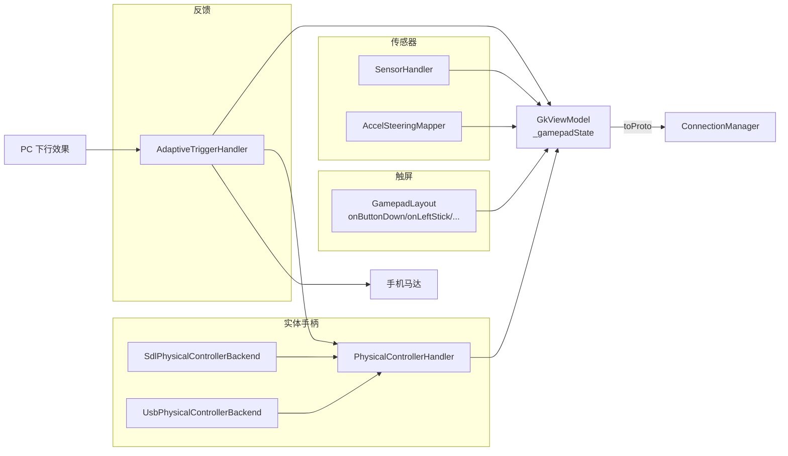

# 输入层（input）

> 覆盖 `android/src/main/java/com/zyz4/gkme/input/`（**不含** `input/usb/*` Java 驱动，见
> [usb-drivers.md](usb-drivers.md)）与 `model/GamepadState.kt`、`model/PhysicalControllerMapping.kt`、
> `model/MouseGestureAction.kt`、`model/SlideDirection.kt`。
>
> 输入层的产物是统一的 `GamepadState`：无论来自触屏控件、手机传感器，还是实体手柄，
> 最终都在 `GkViewModel` 汇总，再由 [service-transport.md](service-transport.md) 发出。

---

## 1. 职责边界与数据流

- **状态容器**：`model/GamepadState.kt`。
- **触屏路径**：`view/GamepadLayout` → `GkViewModel.on*` → `_gamepadState`。
- **物理手柄路径**：`PhysicalControllerHandler` facade，二选一 backend（SDL3 / Axixi2233 USB）。
- **体感路径**：`SensorHandler`（手机）+ `AccelSteeringMapper`（加速度计转向）+ `SensitivityCurve`。
- **反馈路径**：`AdaptiveTriggerHandler` 解析 PC 自适应扳机并路由到各执行器。
- **去回环**：`VirtualGamepad` 排除 GKME 自建的虚拟手柄。

---

## 2. 核心数据模型

### 2.1 GamepadState

`model/GamepadState.kt`。统一手柄状态，含按钮位、模拟量、传感器、鼠标、触摸板、键盘。

- 按钮位定义在 §[protocol 8.1](protocol.md#81-gamepadinputbuttonsmodelgamepadstatektxinput-掩码)。
- `dpad` 为 hat（1/2/4/8/组合），与 `buttons` 里的十字键位并存，映射时折叠。
- `mouseButtons` 与 `mouseGestureButtons` 故意分离，序列化时取并集。
- `data class TouchPoint(id, x, y, active)`。

### 2.2 GamepadInputProcessor

`input/GamepadInputProcessor.kt`。扩展函数 `GamepadState.toProto(...)` 把状态序列化为
protobuf `GamepadInput`。要点：

- `mouseButtons or mouseGestureButtons` 取并集。
- gyro/accel 全零时**不写入**字段（表示无传感器）。
- 键盘 scanCode 与 modifier 一并写入。

> 同文件的 `object GamepadInputProcessor {}` 为空壳，当前无调用点（dead code）。

### 2.3 VirtualGamepad

`input/VirtualGamepad.kt`。识别 GKME 自建虚拟手柄（uinput/uhid），避免“本机输入 → 虚拟手柄 →
被当实体读回”的回环。

- `VIRTUAL_VENDOR_PRODUCTS`：
  - `0x045E/0x02FD`（uinput Xbox One S）
  - `0x054C/0x09CC`（uhid DS4）
  - `0x054C/0x0CE6`（uhid DualSense）
  - `0x057E/0x2009`（uhid Switch Pro）
- `@Volatile virtualGamepadActive` 由 `GamepadInjector` 维护；仅在 active 期间按 vendor/product 排除
  （否则会连真手柄一起隐藏）。
- Switch Pro 经内核 `hid-nintendo` 后 input 名称被改写，故只按 vendor/product 判断。

---

## 3. 传感器与体感

### 3.1 SensorHandler

`input/SensorHandler.kt`。注册手机 `SensorManager`，以 `StateFlow<SensorData>` 暴露。

- 注册 `GYROSCOPE` / `ACCELEROMETER` / `GAME_ROTATION_VECTOR` / `ROTATION_VECTOR`，`SENSOR_DELAY_GAME`。
- `SensorData`：gyro、accel、rotVec、worldDx/worldDy。
- `remapToOrientation`：按 `GyroOrientation`（LANDSCAPE/PORTRAIT/PORTRAIT_INVERTED）重映射，再按
  `isDeviceInverted` 翻转。
- `computeWorldDelta`：用重力方向把 gyro 分解为世界 yaw/roll 两轴并加权。
- `onSensorChanged` 中 GAME_ROTATION_VECTOR 分支通过差分四元数算角轴增量。

> **实现注意**：旋转矢量分支存在语义混乱——`SensorManager.getOrientation` 结果写入名为 `quat` 的
> `FloatArray(4)`，`quat[3]` 恒为 0；该分支也**不经过** `remapToOrientation`，`GyroOrientation`
> 在此路径不生效。`TYPE_ROTATION_VECTOR` 被注册但无对应分支。

### 3.2 SensitivityCurve

`input/SensitivityCurve.kt`。陀螺仪/加速度计转摇杆与屏幕摇杆共用的灵敏度曲线。

- 单调三次 Hermite（Fritsch–Carlson）插值，防止过冲。
- `evaluate(curve, t)`：空曲线恒等。
- `applyRadial(curve, x, y, fullScale)`：按模长做曲线并保持方向。
- 曲线格式：扁平 `[x0,y0,x1,y1,...]`，与 `view/CurveEditorView` 强耦合。
- 使用点：屏幕摇杆（`JoystickView`）、陀螺仪转摇杆（`GkViewModel`）、加速度计转向（`AccelSteeringMapper`）。
- 应用顺序统一为“死区之后、灵敏度/缩放之前”。

### 3.3 AccelSteeringMapper

`input/AccelSteeringMapper.kt`。加速度计→摇杆（“方向盘”），带陀螺仪融合抗平移、多圈角度追踪。

- `update(aX,aY,aZ, baseDirection, orientation, inverted, sensitivity, deadZone, reverseDeadZone, curve, gyro..., dt)`。
- 有陀螺仪时用陀螺仪积分 + 慢速加速度计校正（含 180° 歧义消解）；无陀螺仪时用离面重力符号推断半圈。
- 常量：`DEFAULT_DT=0.02`、`MAX_DT=0.05`、`TAU=1.0`、`GRAVITY_TAU=2.0`、
  `LINEAR_ACCEL_TOLERANCE=0.4`、`MIN_GRAVITY=0.1`、`MAX_WHEEL_CORRECTION=0.05`。
- **非线程安全**，由单一 IO 发送循环串行调用；手机与手柄各一份实例。

### 3.4 GkViewModel 中的体感汇总

- `startSensorSendLoop` 在 IO 每循环读取 `sensorData`：
  - 陀螺仪模式（HANDHELD/MOUSE/LEFT_STICK/RIGHT_STICK）：按 `gyroCoordinateSystem` 映射、
    死区/反死区、`SensitivityCurve.applyRadial`。
  - 加速度计模式：调用 `AccelSteeringMapper.update`。
- `onPhysicalControllerGyro` 处理手柄陀螺仪，按 `gyroSensitivityX/Y/Z` 缩放。

---

## 4. 物理手柄：双后端 facade

### 4.1 PhysicalControllerBackend（接口）

`input/PhysicalControllerBackend.kt`。SDL3 与 Axixi2233 USB 两个 backend 的公共契约。

- `data class ControllerInfo(id, name, motorCount, hasTriggerRumble, hasAdaptiveTrigger, hasGyro,
  hasAnalogTrigger, hasTouchpad, supportedButtons)`。
- 只读 Flows：`isConnected`、`controllerState`、`connectedControllers`、`gyroData`、`accelData`。
- 配置项：`controllerGyroEnabled`、`inputControllerIndex`、`gyroControllerIndex`、
  `gameVibrationDevice`、`swapPhoneMotors`、`swapControllerMotors`。
- 生命周期：`start/stop/onControllerGyroSettingChanged/ensureGyroRegistered`。
- 事件：`handleKeyEvent/handleMotionEvent/setCapturedTouchpadState`。
- 输出：`setLedColor`、`setControllerMotorsVibration`、`rumble`、`setVoiceCoilMotorOutput`、
  控制器音频 / HD rumble / 自适应扳机 / compact frame（均有默认空实现）。

### 4.2 PhysicalControllerHandler（facade）

`input/PhysicalControllerHandler.kt`。按用户设置选择/切换 backend，透明 fallback，并把 backend Flows
镜像成自己的 Flows，保证切换时收集者不失效。

- `driver`（`ControllerDriver`：`SDL3` / `AXIXI2233_USB`）+ `fallbackToSdl`。
- `createAndStartBackend()`：new backend、回灌设置、`start()`、`startMirroring`。
- **兼容性监控**（`COMPATIBILITY_CHECK_INTERVAL_MS=1000`，Main 线程）：用户选 USB driver 但
  `hasSystemGamepad()` 为真且 `isUsbDriverCompatible()` 为假时自动切 SDL；支持的设备接入后恢复 USB。
- `isUsbDriverCompatible()`：遍历 `UsbManager.deviceList`，用各控制器 `canClaimDevice` 判断。
- `hasSystemGamepad()`：遍历 `InputDevice`，排除 `VirtualGamepad.matches`。

> thread：生命周期/切换/镜像 collect 均在 `Dispatchers.Main.immediate`；
> `isUsbDriverCompatible`/`hasSystemGamepad` 也在 Main（每秒一次）。

### 4.3 SdlPhysicalControllerBackend

`input/SdlPhysicalControllerBackend.kt`（约 1090 行）。SDL3/HIDAPI 后端。

- 专用轮询线程 `GkmeSdlPoll`，每 2ms `nativePollState`；每 50 帧刷 USB 设备列表、每 125 帧刷控制器列表。
- Android key/motion 事件经 `SdlPlatform` → native。
- **`nativePollState` out 布局**（`SdlNative.kt:58-61`）：
  `0 buttons, 1 lx, 2 ly, 3 rx, 4 ry, 5 lt, 6 rt, 7 dpad, 8 touchCount,
   9/10 touch0 x/y, 11/12 touch1 x/y, 13 touchpadTouch, 14 touchpadClick, 15 valid`。
- 传感器：`nativePollSensor` 返回 6 float（gyro0..2, accel0..2）。
- **振动策略**：优先 Android `Vibrator`（InputDevice 马达），SDL HIDAPI 仅作 fallback
  （SDL queued write 丢 stop 会永久 latched）。
- 触摸板：`assignSlots` 改编自 Moonlight（GPLv3），`canonicalSlots` 恒输出两个稳定 slot；
  坐标硬编码 1919/942。
- LED：`hasLed → nativeSetControllerLed`；`hasPlayerLed → playerIndex=bitCount-1`。

> thread：`pollLoop` 专用线程直接写 `StateFlow`；`handleKeyEvent/handleMotionEvent` 由 Main 调用；
> 触摸板状态可能同时来自 Main 与 pollLoop，二者通过 `_controllerState.value` 的
> read-modify-write 存在丢更新风险。

### 4.4 UsbPhysicalControllerBackend

`input/UsbPhysicalControllerBackend.kt`（约 770 行）。Axixi2233 USB 驱动后端。

- 实现 `UsbDriverListener`，bind `UsbDriverService`；收到 `deviceAdded/Removed`、
  `reportControllerState/Motion/TouchpadEvent`。
- 轴：driver 的 float（-1..1）→ `*32767` Short；扳机 `*255`；陀螺仪 deg/s → rad/s。
- 触摸：driver 归一化 0..1 → `*1919/*942`，分配 2 个 slot。
- 额外支持 DualSense voice-coil PCM / 控制器音频 / Switch HD rumble（见 [usb-drivers.md](usb-drivers.md)）。
- 常量：`TRIGGER_DIGITAL_THRESHOLD=0.5`、`VOICE_COIL_SILENCE_TIMEOUT_NS=200ms`、
  `PLAYER_LED_PATTERNS=[0x04,0x0A,0x15,0x1B,0x1F]`。
- **互斥**：voice-coil 活跃时 HID 马达置 0，避免 DualSense 音频/震动 ping-pong。

### 4.5 SdlNative / SdlPlatform / SdlAudio

| 文件 | 职责 |
|------|------|
| `input/SdlNative.kt` | `libgkme_sdl.so` 的 JNI 声明（手柄/传感器/音频） |
| `input/SdlPlatform.kt` | 初始化 SDL Java glue（`org.libsdl.app.*`），转发 key/motion 事件 |
| `input/SdlAudio.kt` | SDL 音频设备枚举与低延迟播放 |

- `SdlPlatform.ensureCore` 先调 `nativeGetControllerCount()` 触发 `libSDL3.so` 的 `JNI_OnLoad`，
  再 `SDL.setupJNI/initialize/setContext`。应用**不继承 `SDLActivity`**，把 SDL 当 library 使用，
  因此事件需自行 forwarding。
- `SdlAudio`：`HANDLE_VOICE_COIL=1`、`HANDLE_CONTROLLER_AUDIO=2`；
  `DEFAULT_DEVICE=-1`（SDL）与 `AudioDevice.AUTO_SOUND_DEVICE_ID=0` 是两套 sentinel。

---

## 5. 自适应扳机

### 5.1 AdaptiveTriggerEffect

`input/AdaptiveTriggerEffect.kt`。解析 PC 的 11 字节效果包，抽象为“扳机位置 → 振幅(0..255)”曲线。

- 模式：`ZONE` / `RANGE` / `FROM_POSITION`。
- 常量：`SIMPLE_FEEDBACK=0x01`、`SIMPLE_WEAPON=0x02`、`OFF=0x05`、`SIMPLE_VIBRATION=0x06`、
  `LIMITED_FEEDBACK=0x11`、`LIMITED_WEAPON=0x12`、`FEEDBACK=0x21`、`BOW=0x22`、`GALLOPING=0x23`、
  `WEAPON=0x25`、`VIBRATION=0x26`、`MACHINE=0x27`；OFF 集合含 `0x00,0xFC,0xFD,0xFE`。
- 阻力类效果 `risingOnly=true`，只在实际按压加深时震动。
- `vibrationPacket(amplitude, freq)` 合成 DualSense `0x26 Vibration` 包；频率字节必须非 0。

### 5.2 AdaptiveTriggerHandler

`input/AdaptiveTriggerHandler.kt`。路由 PC 效果到选定执行器。

- 方法均 `@Synchronized`（网络线程调 `onEffects`/`onTriggerRumble`，Main 调 `onTriggerPositions`/`setTarget`）。
- 目标分支（`AdaptiveTriggerTargetType`）：`NONE` / `PHONE_MOTOR` / `CONTROLLER_MOTOR` / `CONTROLLER_TRIGGER`。
- `rumbleActive`（Xbox 扳机）优先于效果字节；`swapAdaptiveTriggers` 交换左右。
- DualSense 支持 `hasAdaptiveTrigger` → 原生效果；仅 `hasTriggerRumble` → 扳机震动；否则手柄马达。

---

## 6. 物理手柄重映射目录

`model/PhysicalControllerMapping.kt`：

- `PhysicalInputKind { BUTTON, JOYSTICK, TOUCHPAD }`。
- `PhysicalInput(key, label, kind, defaultOutputs, bitMask)`。
- `PhysicalInputMapping(outputs: List<Int>, gyroActivate: Boolean)`。
- `PhysicalInputs`：
  - 背键位：`PADDLE_R1=0x400000`(bit22) … `PADDLE_L2=0x2000000`(25)（需与 `sdl_bridge.cpp` 一致）。
  - `STANDARD_BUTTON_MASK`、`BUTTONS`、`GYRO_ONLY`、`ALL`。
  - `byKey / defaultOutputsFor / isPaddle / PADDLE_MASK`。
- 语义：映射缺失键 = 用默认；空 outputs 显式禁用。

`GkViewModel.applyPhysicalMappings` 把 raw 输入映射成 output bits / 负键盘码 / 陀螺激活；
`PHYSICAL_TRIGGER_MAP_THRESHOLD=128`、`PHYSICAL_STICK_GYRO_THRESHOLD=8000`。

---

## 7. 枚举

| 文件 | 内容 |
|------|------|
| `model/MouseGestureAction.kt` | `NONE/MOVE_CURSOR/LEFT_CLICK/RIGHT_CLICK/MIDDLE_CLICK/LEFT_DRAG/RIGHT_DRAG/MIDDLE_DRAG/SCROLL`；`TAP_ACTIONS`/`SWIPE_ACTIONS` |
| `model/SlideDirection.kt` | `DOWN/UP/LEFT/RIGHT` + `jsonValue` |

> `fromString/fromName` 未知值分别静默回退 `DOWN`/`NONE`。

---

## 8. 已知问题 / 注意事项

| 问题 | 证据 |
|------|------|
| [已修复] `SensorHandler` 旋转矢量分支 `quat[3]` 恒 0，且绕过 `remapToOrientation` | `SensorHandler.kt:152-183` |
| [已修复] `TYPE_ROTATION_VECTOR` 注册但无处理分支 | `SensorHandler.kt:64` |
| [已修复] `SdlPhysicalControllerBackend` 的触摸板状态存在 Main/pollLoop 竞争 | `commitTouchpad` vs `updateStateFromNative` |
| [已修复] SDL 触摸坐标硬编码 1919/942 | `SdlPhysicalControllerBackend.kt:757-758, 917-918` |
| `nativeGetControllerMotorCount` 为占位值，实际优先 Android 马达数 | `SdlPhysicalControllerBackend.kt:259-263` |
| [已修复] `PhysicalControllerHandler.controllerHasGyro` setter 为空 | `PhysicalControllerHandler.kt:88` |
| [已修复] USB 后端 `supportedButtons` 恒为 `STANDARD_BUTTON_MASK`，不反映真实能力 | `UsbPhysicalControllerBackend.kt:377` |
| `inputControllerIndex` 是“连接列表索引”，backend 重建后语义可能漂移 | `PhysicalControllerHandler` |
| `AdaptiveTriggerHandler` 频率取“较响通道”，GALLOPING/MACHINE 两通道频率可能不同 | `AdaptiveTriggerHandler.kt:152-165` |
| `GamepadState.buttons` 为 `UInt` 而部分常量是 `Int` | `GamepadState.kt:44-65` |
| [已修复] `SensorHandler.computeWorldDelta` 含线性加速度耦合 | `SensorHandler.kt:93-128` |

---

## 9. 相关文档

- USB 驱动原始解析：[usb-drivers.md](usb-drivers.md)
- 触屏如何产生 `GamepadState`：[view-ui.md](view-ui.md)
- 自适应扳机下游（手机马达/音圈）：[haptic.md](haptic.md)
- 上报协议：[protocol.md](protocol.md)
