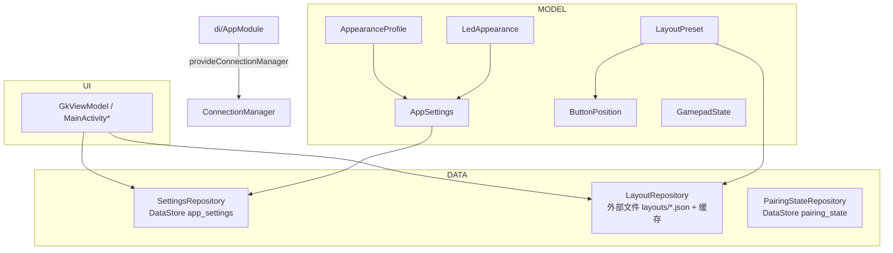
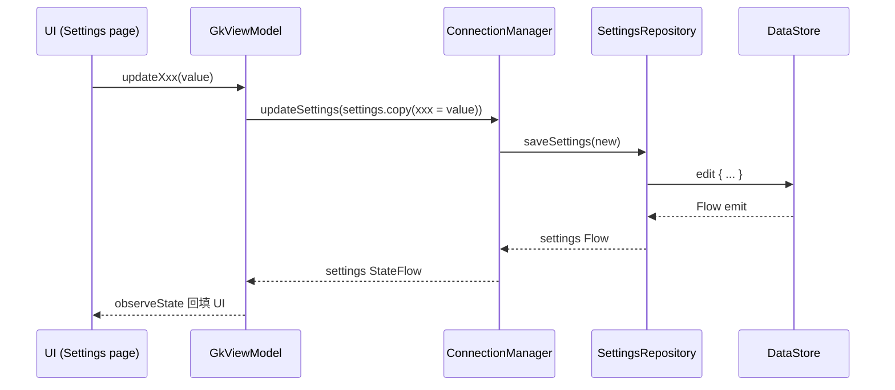

# 数据模型与持久化（model / data / di）

> 覆盖 `android/src/main/java/com/zyz4/gkme/model/`、`data/`、`di/`。
>
> 本层是应用状态的“唯一真相源”：`AppSettings`（全局设置）与 `LayoutPreset`（每个布局预设）
> 经 DataStore / 文件持久化，`GkViewModel` 只持有它们的副本并写回。

---

## 1. 总览



---

## 2. 数据模型（model）

### 2.1 AppSettings

`model/AppSettings.kt`（约 350 行）。全局设置的不可变 data class，字段可分为：

| 分组 | 代表字段 |
|------|----------|
| 连接 | `connectionMode`、`controlType`、`targetPlatform`、`virtualGamepadType`、`displayMode`、`pollingRate`、`deviceName` |
| 预设 | `currentPresetName`、`isEditMode` |
| 按键震动 | `vibrationPress/ReleaseType`、`vibrationPress/ReleaseViewEffect`、`vibrationPress/ReleaseDuration`、`vibrationPress/ReleaseIntensity`、`vibrationPress/ReleaseFrequency` |
| 游戏震动 | `gameVibrationDevice`、`gameVibrationDeviceConnected`、`swapPhoneMotors`、`swapControllerMotors`、`hdVibrationEnabled` |
| 自适应扳机 | `adaptiveTriggerDevice`、`adaptiveTriggerDeviceConnected`、`swapAdaptiveTriggers` |
| 陀螺仪 | `gyroEnabled`、`gyroSensitivityX/Y/Z`、`gyroOrientation`、`gyroBaseDirection`、`gyroCoordinateSystem`、`gyroMode`、`gyroModeSensitivity`、`gyroDeadZone`、`gyroReverseDeadZone`、`gyroStickCurve`、`gyroActivateMode`、`controllerGyroEnabled(Connected)`、`gyroControllerIndex(Connected)` |
| 物理手柄 | `controllerDriver`、`inputControllerIndex` |
| 音频 | `voiceCoilDevice(Connected)`、`swapVoiceCoilMotors`、`controllerAudioDevice` |
| 外观 | `bg*/btn*/joy*/tp*/dpadPad*` 的颜色/填充/描边/图片路径、`iconMaxSize`、`ledBoundColors` |
| 杂项 | `keepScreenOn`、`floatingOpacity`、`floatingKeepAlive`、`autoStartEnabled` |

#### 双态设置（连接/未连接）

游戏震动、语音线圈、自适应扳机、陀螺源各有**连接态与未连接态两套字段**，通过扩展函数按
`physicalControllerConnected` 选择：

```kotlin
fun AppSettings.gameVibrationDeviceFor(connected: Boolean): VibrationDevice
fun AppSettings.voiceCoilDeviceFor(connected: Boolean): AudioDevice
fun AppSettings.adaptiveTriggerDeviceFor(connected: Boolean): AdaptiveTriggerDevice
fun AppSettings.gyroControllerIndexFor(connected: Boolean): Int
fun AppSettings.gyroMasterEnabledFor(connected: Boolean): Boolean
fun AppSettings.gyroSourceFor(connected: Boolean): GyroSource
fun AppSettings.virtualGamepadNativeBackend(): Int   // 0 uinput / 1 uhid
fun AppSettings.virtualGamepadUhidProfile(): Int     // 1 DS4 / 2 DS5 / 3 Switch Pro
```

#### 枚举

| 枚举 | 取值 |
|------|------|
| `ConnectionMode` | `WIFI / BLUETOOTH / USB / LOCAL` |
| `ControlType` | `CONTROLLER / CONTROLLED` |
| `TargetPlatform` | `WINDOWS / ANDROID / LINUX / ANDROID_GAMEPAD_ONLY / UNIVERSAL_KM / WINDOWS_GAMEPAD_ONLY` |
| `VirtualGamepadType` | `XBOX_ONE_S / DS4 / DUALSENSE / SWITCH_PRO`（含 `nativeBackend`/`uhidProfileId`） |
| `DisplayMode` | `XBOX / PLAYSTATION / SWITCH` |
| `ControllerDriver` | `SDL3 / AXIXI2233_USB / INPUT_MANAGER` |
| `VibrationType` | `NONE / VIEW / VIBRATION_EFFECT` |
| `VibrationDeviceType` | `PHONE / CONTROLLER / NONE` |
| `AdaptiveTriggerTargetType` | `NONE / PHONE_MOTOR / CONTROLLER_MOTOR / CONTROLLER_TRIGGER` |
| `AudioDeviceType` | `NONE / PHONE_MOTOR / PHONE_SPEAKER(废弃) / CONTROLLER / SOUND_DEVICE` |
| `GyroOrientation` | `LANDSCAPE / PORTRAIT / PORTRAIT_INVERTED` |
| `GyroSourceType` | `CONTROLLER / PHONE / NONE` |
| `GyroBaseDirection` | `VERTICAL / HORIZONTAL` |
| `GyroCoordinateSystem` | `YAW / ROLL / YAW_ROLL / WORLD` |
| `GyroMode` | `NONE / HANDHELD / MOUSE / LEFT_STICK / RIGHT_STICK / ACCELEROMETER_LEFT_STICK / ACCELEROMETER_RIGHT_STICK` |
| `GyroActivateMode` | `ALWAYS / BUTTON` |
| `HapticEffect` | 12 种按键触觉，各带 `prebakedId`（10001-10050） |
| `FillType` | `SOLID_COLOR / IMAGE` |

`VibrationDevice` / `AdaptiveTriggerDevice` / `AudioDevice` / `GyroSource` 为携带
`controllerIndex` 的 data class，均有 `PHONE`/`NONE`/`controller(index)` 工厂。

> `AudioDevice.PHONE_SPEAKER` 已废弃，仅保留 ordinal 兼容；手机扬声器现作为 `SOUND_DEVICE` 枚举。

### 2.2 LayoutPreset 与 ButtonPosition

`model/LayoutPreset.kt` + `model/ButtonPosition.kt`。每个布局预设的内容。

`LayoutPreset` 字段：`version`、`buttons: List<ButtonPosition>`、陀螺仪字段
（`gyroOrientation/ActivateMode/Mode/ModeSensitivity/DeadZone/ReverseDeadZone/StickCurve`）、
`physicalInputMappings`、`volumeUpBits`、`volumeDownBits`。

`ButtonPosition` 字段（关键）：`id`、网格坐标 `x/y/width/height`、`visible`、`lockAspect`、
`swipeTrigger`、`rotation`、`isCustom/customText/customBits`、`roundShape`、`doubleClickEnable`、
`isKeypad/keypadTexts/keypadBits/keypadEightWay`、`centerShape`、`sensitivityCurve`、
`joystickSensitivity`、`touchpadMode`、`prediction`、`deadZone/reverseDeadZone`、`idleOpacity/activeOpacity/followAreaOpacity`、
`followAreaEnabled/X/Y/W/H`、`overlapTrigger/followAreaOverlapTrigger`、鼠标板字段
（`mouseSensitivity/Acceleration/scrollSensitivity/mouseMoveSlop/invertScroll*` 与 7 个手势动作）、
`linearTriggerEnabled/slideDirection/travelDistance`、`gyroActivate`、`autoHold`、`isKeyboard`。

#### JSON 序列化与向后兼容

`LayoutPreset.fromJson` / `toJson` 手写（非直接 Gson 反射），承担**旧版本迁移**：

- 移除 `lockAspect`/`isKeyboard` 并**从硬编码表重建**（`LOCK_ASPECT_FALSE_IDS`、`IS_KEYBOARD_IDS`）。
- 为缺失字段补默认（`overlapTrigger`、`followArea*`、`deadZone`、`joystickSensitivity`、`touchpadMode`、`prediction`、鼠标板字段、`keypad*`、
  `gyroActivate`、`autoHold` 等）。
- `migrateLegacyOpacity`：旧透明度（0 不透明 / 255 全透明）→ 不透明度（100 不透明 / 0 透明），
  处理 `idleTransparency`/`activeTransparency`/`followAreaTransparency`。
- `slideDirection` 大小写归一化。
- 键位表 `keypadTexts`/`keypadBits` 不足时补齐 8 方向默认值。

`toJson` 采用“只在非默认值时才写”的稀疏写法，保持预设文件精简。

键位区域约定（`ButtonPosition` companion）：`KEYPAD_BASE_ID="customKeypad"`、
`KEYPAD_COUNT=5`（上/下/左/右/中）、`KEYPAD_EIGHT_WAY_COUNT=9`（+ 左上/右上/左下/右下）。

### 2.3 AppearanceProfile

`model/AppearanceProfile.kt`。`AppSettings` 外观字段的子集，用于**导出/导入外观 ZIP**。

- `fromAppSettings` / `fromAppSettingsWithImageNames`（把本地图片路径映射为 ZIP 内文件名）/
  `toJson` / `fromJson`（Gson + `@SerializedName`）。

### 2.4 LedAppearance

`model/LedAppearance.kt`。外观颜色绑定实体手柄 LED。

- `MIN_COLOR=0xFF1A1A1A`（最低亮度下限）。
- `DEFAULT_BOUND_COLORS={tpOutlineColor}`。
- `colorFieldNames`：15 个可绑定的颜色字段。
- `clamp(ledColor)`：把暗色提升到下限并保留色相/饱和度。
- `applyLedColor(settings, ledColor)`：写所有绑定字段。
- `setColorField(settings, field, color, bind)`：设置颜色并绑定/解绑。

### 2.5 GamepadState

`model/GamepadState.kt`，见 [input.md §2.1](input.md#21-gamepadstate) 与
[protocol.md §8](protocol.md#8-载荷语义参考)。它是运行时状态，**不持久化**。

---

## 3. 持久化

### 3.1 SettingsRepository

`data/SettingsRepository.kt`。基于 `androidx.datastore.preferences`（name `app_settings`）。

- `settings: Flow<AppSettings>`：把每个 preference key 映射为 `AppSettings`。
- `saveSettings(settings)`：逐字段写回。
- `Keys` object 集中定义所有 key。
- **迁移逻辑**：
  - `virtualGamepadType`：缺失时从旧 `virtual_gamepad_backend` + `uhid_profile` 迁移。
  - `voiceCoilDevice`：缺失时从旧 `left_voice_coil_output`/`right_voice_coil_output` 迁移
    （`migrateVoiceCoilDevice`）。
  - `controllerAudioDevice`：缺失时从旧 `controller_audio_output` ordinal 迁移
    （`restoreControllerAudioDevice`）。
  - `sanitizeVoiceCoilType`：`PHONE_SPEAKER` → `PHONE_MOTOR`。
- 枚举反序列化统一用 `entries.getOrElse(ordinal) { default }`，容忍越界。

### 3.2 LayoutRepository

`data/LayoutRepository.kt`。布局预设的文件仓库 + 两级缓存。

- **存储位置**：`context.getExternalFilesDir(null)/layouts/<name>.json`。
- **内置预设**：`BUILT_IN_PRESETS = { "完整控制器": R.raw.full_con, "鼠标": R.raw.mouse, "键盘": R.raw.keyboard }`。
- **缓存**：
  - 内存缓存 `memoryCache: name -> LayoutPreset`；
  - 磁盘缓存 `cacheDir/preset_cache/<name>.cache` + `cache_index.json`（name -> checksum）。
- **校验**：`computeChecksum`（CRC32）。内置预设比较 raw 资源 checksum，用户预设比较源 JSON checksum；
  不匹配则 invalidate。
- API：`listPresets`（内置在前）、`loadPreset`、`savePreset`、`deletePreset`、`renamePreset`、
  `hasAnyPreset`、`isBuiltInPreset`、`getDefaultPreset`、`createDefaultPreset`、`clearCache`。

> `createAllBuiltInPresets()` 为空实现（内置预设直接从 raw 资源加载）。

### 3.3 PairingStateRepository

`data/PairingStateRepository.kt`。DataStore（name `pairing_state`）保存蓝牙已配对设备
`address`/`name`。`savePairedDevice` / `clearPairedDevice` / `getPairedDeviceAddress`。

### 3.4 其他持久化

- 外观图片：`filesDir/appearance_images`（JPEG）。
- 外观 ZIP 导入导出：见 [view-ui.md §2.2](view-ui.md#22-mainactivityappearancekt外观页)。
- RichTap 预置：`assets/richtap_prebaked.json`（只读）。

---

## 4. 依赖注入（di）

`di/AppModule.kt`：Hilt `@Module @InstallIn(SingletonComponent::class)`，仅提供一个
`@Singleton ConnectionManager`（注入 `@ApplicationContext`、`PairingStateRepository`、`SettingsRepository`）。

`GkmeApp.kt`：`@HiltAndroidApp class GkmeApp : Application()`。

> **注意**：`SettingsRepository` / `LayoutRepository` / `PairingStateRepository` 因有
> `@Inject constructor` + `@Singleton` 被 Hilt 自动提供。但 `ConnectionManager` 内部持有的一部分对象
> （`UdpService`/`UsbService`/`DsuService`/`ClassicHidTransport`/`AudioPlaybackService`）是手动 `new`，
> 未经 Hilt；`AudioPlaybackService` 的 `@Singleton` 注解在该路径下无效（见
> [service-transport.md §10](service-transport.md#10-di-与入口)）。

---

## 5. 数据流示例：修改一次设置



---

## 6. 已知问题 / 注意事项

| 问题 | 证据 |
|------|------|
| `LayoutPreset` 的 `lockAspect`/`isKeyboard` 由硬编码表重建，新增控件必须同步维护两张表 | `LayoutPreset.kt:14-34,156-162`；`MainActivityControls.allControls` |
| 键位/外观字段新增时需同时更新 `LayoutRepository` 的迁移默认值，否则旧预设可能缺字段 | `LayoutPreset.fromJson` |
| [已修复] `AudioDevice.PHONE_SPEAKER` 仅靠 ordinal 兼容，UI 不再提供（已加稳定 `persistId` + `fromPersistId` 迁移） | `AppSettings.kt:101-102` |
| `virtualGamepadType` 旧键迁移只在缺失新键时执行 | `SettingsRepository.kt:172-182` |
| 内置预设 checksum 变化（升级）会 invalidate 缓存，用户对内置预设的修改不会覆盖 raw | `LayoutRepository.kt:107-116` |
| [已修复] `createAllBuiltInPresets()` 为空实现 | `LayoutRepository.kt:241-243` |
| [部分修复] `ConnectionManager` 内部分依赖手动 `new`，Hilt 图不完整（`AudioPlaybackService` 已改为构造注入；`UdpService`/`UsbService`/`DsuService` 仍手动 new） | `AppModule.kt`；`ConnectionManager.kt:75` |

---

## 7. 相关文档

- 状态如何驱动 UI：[view-ui.md](view-ui.md)
- 设置项语义（连接/陀螺仪/音频等）：各模块文档
- 连接层如何使用设置：[service-transport.md](service-transport.md)
- 虚拟手柄类型 → native 后端：[controlled-native.md](controlled-native.md)
