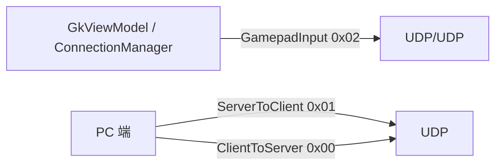
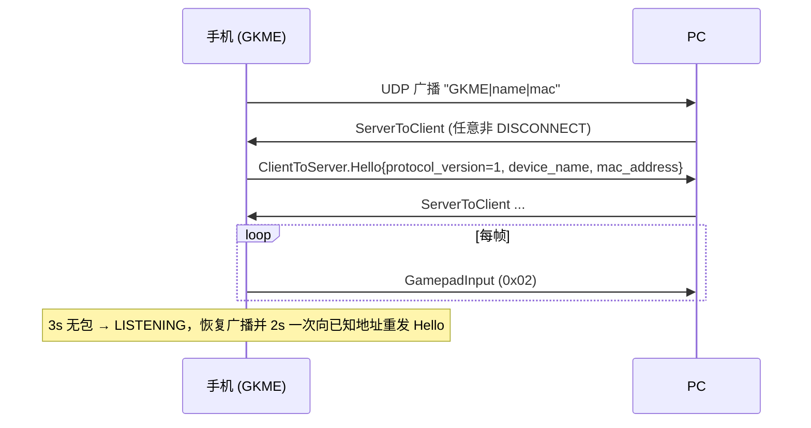

# 协议与接口

> 覆盖：protobuf 报文、UDP/USB 帧格式、WiFi/USB 发现与握手、DSU、经典蓝牙 HID 报告、AIDL 接口。
>
> 相关代码：`android/src/main/proto/gamepad_state.proto`、`service/UdpService.kt`、`service/UsbService.kt`、
> `service/DsuCodec.kt`、`service/GamepadStateMapper.kt`、`service/ClassicHidTransport.kt`、
> `aidl/com/zyz4/gkme/controlled/*.aidl`、`cpp/gkme_hid_descriptors.h`。

---

## 1. 总览

GKME 的线上协议统一以 **protobuf**（lite runtime）描述，三种传输共用同一套消息，仅**帧格式**不同：

| 传输 | 方向 | 帧格式 | 端口 |
|------|------|--------|------|
| UDP (WiFi) | 双向 | `[1 byte type][protobuf]` | 37284 |
| USB (adb) | 双向 | `[4 byte BE length][1 byte type][protobuf]` | 37284（loopback） |
| DSU | 双向 | 独立二进制协议（非 protobuf） | 发现 26761 / 数据 26760 |
| 经典蓝牙 HID | 设备→主机 | HID report（非 protobuf） | — |

被控端模式在 WiFi 上复用同一 UDP 协议（角色反转）。



---

## 2. `gamepad_state.proto`

文件：`android/src/main/proto/gamepad_state.proto`。`java_package = com.zyz4.gkme.proto`，
`java_multiple_files = true`。PC 端命名空间为 `GKME.Protocol`（C#）。

### 2.1 上行（手机 → PC）

```proto
message ClientToServer {
  oneof payload { Hello hello = 1; }
}

message Hello {
  uint32 protocol_version = 1;   // 当前 = 1
  string device_name = 2;
  uint32 controller_index = 4;
  string mac_address = 5;        // 实为 Settings.Secure.ANDROID_ID
}

message GamepadInput {
  uint32 buttons = 1;            // GKME 自定义按键位掩码（见 §8.1）
  sint32 left_stick_x = 2;
  sint32 left_stick_y = 3;
  sint32 right_stick_x = 4;
  sint32 right_stick_y = 5;
  uint32 left_trigger = 6;       // 0..255
  uint32 right_trigger = 7;      // 0..255
  uint32 dpad = 8;               // hat：1 上 2 下 4 左 8 右
  float  gyro_x/y/z  = 9..11;    // rad/s
  float  accel_x/y/z = 12..14;   // m/s²
  uint32 battery_level = 16;     // 0..100
  bool   is_charging = 17;
  repeated TouchPoint touches = 22;
  sint32 mouse_dx = 23;
  sint32 mouse_dy = 24;
  sint32 mouse_wheel = 25;
  sint32 mouse_pan = 26;
  uint32 mouse_buttons = 27;     // bit0 左 / bit1 右 / bit2 中 / bit3 后退 / bit4 前进
  repeated uint32 pressed_scan_codes = 28;   // HID Keyboard/Keypad 用法 ID（Usage 0x04..0xFF）
  uint32 keyboard_modifiers = 30;            // bit0 LCtrl … bit7 RGui
}

message TouchPoint { uint32 id = 1; uint32 x = 2; uint32 y = 3; bool active = 4; }
```

**注意**：gyro/accel 三元组在**全零时被省略**（`GamepadInputProcessor.toProto`），表示“该帧无传感器数据”。

### 2.2 下行（PC → 手机）

```proto
message ServerToClient {
  oneof payload {
    CompactFrame compact_frame = 11;   // 振动 + 扳机 + LED + 测试音
    TriggerEffects trigger_effects = 2;
    Disconnect disconnect = 3;
    ServerHello server_hello = 7;
    AudioFrame audio_frame = 8;
    LedState led_state = 9;
    TestTone test_tone = 10;
    HdRumble hd_rumble = 12;
  }
}

message CompactFrame {               // 单 UDP 包内原子处理，避免同端点 bulkTransfer 竞争
  Vibration vibration = 1;
  TriggerEffects trigger_effects = 2;
  LedState led_state = 3;
  TestTone test_tone = 5;
}

message Vibration { uint32 large_motor = 1; uint32 small_motor = 2; }

message TriggerEffects {
  bytes left_trigger_effect = 1;     // DualSense 自适应扳机 11 字节效果
  bytes right_trigger_effect = 2;
  optional uint32 left_trigger_rumble = 3;   // Xbox 脉冲扳机，与行程无关
  optional uint32 right_trigger_rumble = 4;
}

message LedState { uint32 color = 1; uint32 player_led = 2; }  // color=0xRRGGBB，player_led 位掩码

message AudioFrame {
  uint32 sample_rate_hz = 1; uint32 channels = 2; uint32 bits_per_sample = 3;
  uint32 frame_index = 4; uint32 sample_count = 5; bytes pcm = 6;
}

message TestTone { bool enabled = 1; }   // DualSense 扬声器 1 kHz 本地合成
message ServerHello {
  uint32 protocol_version = 1; string host_name = 2;
  uint32 max_downlink_rate_hz = 3; uint32 recommended_uplink_interval_us = 4;
}
message HdRumble {                 // Switch Pro 本地合成参数（左右各高低频 + 幅度）
  float left_high_freq_hz=1; float left_high_amp=2;
  float left_low_freq_hz=3;  float left_low_amp=4;
  float right_high_freq_hz=5; float right_high_amp=6;
  float right_low_freq_hz=7;  float right_low_amp=8;
}
message Disconnect { string reason = 1; }
```

> `TriggerEffects.left/right_trigger_rumble` 使用 `optional`：**未设置 = 无扳机震动源；显式 0 = 合法停止值**。
> 收到 rumble 字段走 Xbox 脉冲扳机通路，否则把 effect 字节块转发给自适应扳机处理。

---

## 3. UDP(WiFi) 帧与发现握手

`service/UdpService.kt`。手机是 UDP server，端口 `37284`；对**每个本机 IPv4 地址**各绑一个 `DatagramSocket`。

### 3.1 帧格式

```
[1 byte type][protobuf payload]
```

| type | 名称 | 方向 | payload |
|------|------|------|---------|
| `0x00` | `TYPE_CLIENT_TO_SERVER` | PC → 手机 | `ClientToServer` |
| `0x01` | `TYPE_SERVER_TO_CLIENT` | PC → 手机 | `ServerToClient` |
| `0x02` | `TYPE_GAMEPAD_INPUT` | 手机 → PC | `GamepadInput`（键盘报告也复用它） |

手机接收端只处理 `0x01`（`UdpService.kt:253`）。

### 3.2 发现（广播）

手机周期性向 `255.255.255.255:37284` 发送**纯文本**（非 protobuf）：

```
GKME|<deviceName>|<mac>
```

周期约 1s，每个本机地址各一个广播协程。`<mac>` 实为 `Settings.Secure.ANDROID_ID`
（`ConnectionManager.getMacAddress()`），用作稳定设备标识。

### 3.3 握手时序



- 收到任意非 `DISCONNECT` 的 `ServerToClient` 且当前 `activeProtocol != WIFI` 时，手机触发 `doReconnect()`，
  切换 `activeProtocol=WIFI` 并回发 `Hello`（`ConnectionManager.kt:532-551, 685-694`）。
- **未校验来源端口**：`pcAddress` 的端口硬编码为 `PORT`（`UdpService.kt:255`），PC 必须从 37284 源端口发包。

---

## 4. USB(ADB) 帧

`service/UsbService.kt`。手机是 loopback TCP server，绑定 `127.0.0.1:37284`；PC 经
`adb forward tcp:<local> tcp:37284` 接入。复用完全相同的 protobuf 消息，帧格式：

```
[4 byte big-endian length][1 byte type][protobuf payload]
```

- `length` 计入 type 字节 + payload。
- type 常量与 UDP 相同（`0x00/0x01/0x02`）。
- `MAX_FRAME = 16 MiB`；超出即断开连接。
- 握手与 UDP 平行：收到非 `DISCONNECT` 且 `activeProtocol != USB` 时 `doUsbConnect()` 回发同一个 `Hello`。
- bind 失败会回退到 `ServerSocket(PORT)`（通配地址），以应对部分设备 adbd 的地址解析差异。

---

## 5. DSU（Emotion 兼容）

`service/DsuCodec.kt` + `service/DsuService.kt`。实现 Cemuhook/Dolphin 的 DSU 协议，版本
`1001`。端口：发现 `26761`，数据 `26760`。

### 5.1 头部（16 字节，小端）

```
magic(4) | version(2) | payloadLen(2) | crc32(4) | clientId(4)
```

- magic：服务端 `"DSUS"`，客户端 `"DSUC"`。
- CRC32 计算覆盖 `[0,8) + 4 个零字节 + [12,end)`（跳过 CRC 字段本身）。
- **CRC 当前不参与校验**：`decodeHeader` 计算 `computedCrc` 但不比对、不丢弃（`DsuCodec.kt:114-135`）。

### 5.2 事件类型

| 类型 | 值 | 说明 |
|------|----|------|
| `TYPE_VERSION_INFO` | `0x100000` | 版本信息 |
| `TYPE_CONTROLLER_INFO` | `0x100001` | 连接信息（回复） |
| `TYPE_CONTROLLER_DATA` | `0x100002` | 手柄数据 |
| `TYPE_MOTOR_INFO` | `0x110001` | 马达信息 |
| `TYPE_RUMBLE` | `0x110002` | rumble（PC → 手机） |

### 5.3 数据上报

- 手机周期性向 `255.255.255.255:26761` 广播**本机 IP 原始字节**（无 DSU 头），供 PC 识别。
- 在 `26761` 监听 PC 的控制器请求，在 `26760` 收发数据。
- 一旦 `isDataActive`，数据 socket 每轮 `soTimeout=8ms` 后主动发送一帧 `GamepadData`，
  即发送节奏由超时驱动（约 125 Hz，`DsuService.kt:131-147`）。
- `GamepadData`：80 字节 payload + 4 字节 eventType。按钮三字节位映射、START/SELECT 写 255、
  摇杆右移 8 位、Y 轴取负、十字键同时写字节位与四个 0/255 通道、两路触摸（x clamp 0..3838、y 0..1884）、
  陀螺仪转 deg/s、加速度转 g 并翻转符号（`DsuCodec.kt:195-270`）。
- 电量映射见 `batteryFromAndroid()`（`DsuCodec.kt:49-59`）。

---

## 6. 经典蓝牙 HID 报告

`service/ClassicHidTransport.kt` + `service/GamepadStateMapper.kt`。通过 Android
`BluetoothHidDevice` 注册 HID 描述符，PC 作为 HID host 连接。**不使用 protobuf**，直接发 HID report。

### 6.1 Report ID 分配

| 功能 | Report ID | 长度 | 备注 |
|------|-----------|------|------|
| Gamepad（combo） | 19 | 11 字节（Windows） | 与键鼠组合描述符 |
| Gamepad（仅手柄） | 1 | 9 或 11 字节 | 依平台 |
| Keyboard | 17 | 7 字节（modifier + 6 keys） | |
| Mouse | 18 | 9 字节（buttons + 4×int16 LE） | |
| Mouse Resolution Multiplier（Feature） | 20 | 1 字节 | 默认 `0x05` = 高分辨率 |

### 6.2 目标平台描述符

`TargetPlatform` 决定描述符与报告布局：

- `WINDOWS` / `UNIVERSAL_KM`：11 字节手柄报告（3 字节按钮含 18 按钮 + 4×int16 轴）。
- `ANDROID` / `LINUX` / `*_GAMEPAD_ONLY`：9 字节报告（2 字节按钮 + LX/LY + hat + 右摇杆 + RT/LT）；
  Android 与 Linux 的 X/Y 位互换。
- `UNIVERSAL_KM` 仅键鼠，无手柄报告；`sendGamepadState` 在该模式下直接返回。

平台切换 `switchTargetPlatform()` 会清空软件配对、递增 `restartToken`、重新注册描述符，无需重启 App。

### 6.3 鼠标高分辨率

Resolution Multiplier Feature 必须在**独立 Report ID**（20）上声明，值 `0x05`（垂直/水平各置高分辨率），
否则 PC 端会把 120 计数/格压缩为 1 格。`GamepadStateMapper` 与 `MainActivityControls` 在
WIFI/USB 下用 33f 高精度单位，蓝牙下用 1f 传统单位。

---

## 7. 被控端服务接口（被控端 / 本机模式）

`IGamepadService` 是唯一保留的 AIDL 接口：由 Shizuku 在 shell/root 进程实现，App 进程经 Binder 调用，
并定义 Shizuku 约定的退出事务 `exitService() = 16777114`（实际事务号 16777115）。高清震动
`RemoteHapticService` 已改为 App 进程内的普通 Kotlin 类，不再有 AIDL 接口。

### 7.1 `IGamepadService`（`aidl/.../IGamepadService.aidl`）

```aidl
int  create(int backend, int profile, boolean rumbleEnabled);   // 0 成功，负数为 -errno
void update(int buttons, int leftTrigger, int rightTrigger,
            int leftX, int leftY, int rightX, int rightY,
            float gyroX, float gyroY, float gyroZ,
            float accelX, float accelY, float accelZ,
            in int[] touches);
long pumpRumble();                    // 高 16 位左、低 16 位右（注释 0..32767）
void release();
int  createKeyboard();
void updateKeyboard(int modifiers, in int[] usages);
int  createMouse();
void updateMouse(int dx, int dy, int wheel, int pan, int buttons);
void releaseKeyboardMouse();
void exitService();
```

- `backend`：0 = uinput（伪装 Xbox One S），1 = uhid（真实 HID 身份）。
- `profile`：uhid 时 1 = DualShock 4，2 = DualSense，3 = Switch Pro。
- `buttons` 使用 **XInput wButtons 掩码**，bit17 = 触摸板点击。
- `touches`：最多 2 点，每点 4 个 int `[id, x, y, active]`，x∈0..1919、y∈0..942。

### 7.2 高清震动 `RemoteHapticService`（`controlled/RemoteHapticService.kt`）

已不再是 AIDL 接口 / Shizuku 用户服务，而是 App 进程内的普通 Kotlin 类，直接反射调用 RichTap hidden API：

```kotlin
val  available: Boolean                    // 是否支持 RichTap hidden API
val  version: String                       // RichTap core 版本
fun  startPattern(heJson, loop, interval, amplitude, freq): Boolean
fun  stop()
fun  startEffect(heJson): Boolean          // 无参 start()，事件自带参数
val  playerType: Int                       // 0 Google / 1 Tencent / 2 RichTap
fun  supportsRealtimeAdjustment(): Boolean
fun  updateParameter(intensity, frequency): Boolean
```

详见 [haptic.md](haptic.md)。

---

## 8. 载荷语义参考

### 8.1 `GamepadInput.buttons`（`model/GamepadState.kt`，GKME 自定义掩码）

| 位 | 值 | 含义 |
|----|----|------|
| 0 | `0x1` | A |
| 1 | `0x2` | B |
| 2 | `0x4` | X |
| 3 | `0x8` | Y |
| 4 | `0x10` | LB |
| 5 | `0x20` | RB |
| 6 | `0x40` | LT（数字） |
| 7 | `0x80` | RT（数字） |
| 8/9 | `0x100/0x200` | SELECT / START |
| 10/11 | `0x400/0x800` | L3 / R3 |
| 12..15 | `0x1000..0x8000` | 十字键上/下/左/右 |
| 16 | `0x10000` | HOME |
| 17 | `0x20000` | 触摸板点击 |

`GamepadState` 内部另有鼠标键位（bit19-21 = `0x80000/0x100000/0x200000`）与
`MIC_MUTE`（bit18 = `0x40000`）；物理手柄背键位在 bit22-25（`PhysicalInputs.PADDLE_*`），
不属于基础 18 键位布局，仅用于映射输出。

> 该位布局由 GKME 自定义，**并非 XInput**。仅在被控端经 `GamepadInjector.toXInputButtons`
> 翻译成 XInput wButtons 后才写入 `IGamepadService.update`（见 §7.1）。

### 8.2 dpad

同时存在两套表示：`buttons` 中的十字键位（`0x1000..0x8000`）与独立的 `dpad` hat 字段
（1 上 / 2 下 / 4 左 / 8 右）。汇总时由 `GkViewModel.syncDpadFromButtons` 折叠。

### 8.3 鼠标

`mouse_dx/dy/wheel/pan` 为 `sint32`（协议支持高精度，WIFI/USB 下不再截断 ±127）。
屏幕鼠标按钮与鼠标板手势分别写入 `mouseButtons` 与 `mouseGestureButtons`，序列化时取并集。

### 8.4 键盘

`pressed_scan_codes` 为 HID Keyboard/Keypad 用法 ID（Usage，字母 0x04..、数字 0x1E..；
与 `MainActivityControls.Kb` 一致）；`keyboard_modifiers` 为 HID 修饰位掩码
（bit0=LCtrl … bit7=RGui）。键盘报告在 WiFi/USB 下复用 `GamepadInput`（type `0x02`），
在蓝牙下走 Report ID 17。

---

## 9. 已知问题 / 注意事项

| 问题 | 证据 |
|------|------|
| UDP `pcAddress` 端口硬编码为 `PORT`，忽略实际源端口 | `UdpService.kt:255` |
| [已修复] DSU 收到 CRC 错误包仍处理；`isBroadcastPacket` 为死代码 | `DsuCodec.kt:114-135, 61-65` |
| [已修复] `Hello.mac_address` 名为 MAC 实为 `ANDROID_ID`（本地方法已改名为 `getDeviceId`，协议字段名保留） | `ConnectionManager.kt:884-892` |
| 蓝牙主机到设备输出报告（振动）未处理 | `ConnectionManager.handleBtOutputReport` 空实现 |
| `GamepadState.buttons` 为 `UInt`，部分常量声明为 `Int`，比较需 `toUInt()` | `GamepadState.kt:44-65` |
| AIDL `pumpRumble` 注释写 0..32767，被控端按 65535 归一 | `IGamepadService.aidl:27`；`ControlledHostManager.kt:483-484` |

---

## 10. 相关文档

- 传输层实现与状态机：[service-transport.md](service-transport.md)
- 输入如何组装成 `GamepadInput`：[input.md](input.md)、[view-ui.md](view-ui.md)
- 被控端 AIDL 实现与虚拟 HID：[controlled-native.md](controlled-native.md)
- HD 震动 HE 格式：[haptic.md](haptic.md)、[richtap-hd-vibration.md](richtap-hd-vibration.md)
