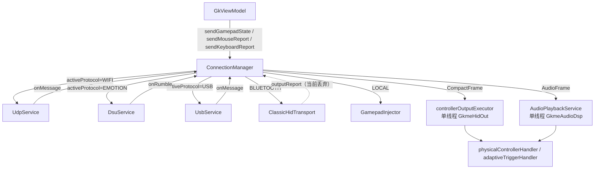

# 服务与传输层（service）

> 覆盖 `android/src/main/java/com/zyz4/gkme/service/` 与 `di/AppModule.kt`、`GkmeApp.kt`。
>
> 本层是连接中枢：编排 WiFi/UDP、USB/ADB、经典蓝牙 HID、DSU 四条传输，以及音频、振动/扳机、LED
> 三类下行通道，并维护连接状态机与重连。协议细节见 [protocol.md](protocol.md)。

---

## 1. 总览

`ConnectionMode`（`model/AppSettings.kt:3`）四种模式对应四条传输：

| 模式 | 传输 | 由谁启动 | 说明 |
|------|------|----------|------|
| `WIFI` | `UdpService` 与 `DsuService` **竞速** | `startWifiServer` / `startDsuServer` | 谁先握手谁成为 `activeProtocol` |
| `USB` | `UsbService`（loopback TCP） | `startUsbServer` | 经 `adb forward` |
| `BLUETOOTH` | `ClassicHidTransport` | `startBluetooth` | Android 9+ |
| `LOCAL` | 无网络传输 | `GamepadInjector` | 直接置 `CONNECTED`，Shizuku 本地注入 |



---

## 2. ConnectionManager

`ConnectionManager.kt`（约 900 行）。Hilt `@Singleton`，由 `di/AppModule.kt:18-24` 提供。

### 2.1 职责

- 持有并编排 `UdpService`、`UsbService`、可选 `ClassicHidTransport`、可选 `DsuService`、`AudioPlaybackService`。
- 对外暴露 `StateFlow`：`connectionState`、`settings`、`ledState`、`pairedDeviceName`、`isBluetoothRunning`。
- 上行入口：`sendGamepadState`、`sendMouseReport`、`sendKeyboardReport`。
- 下行出口（回调）：`onRumbleRequest`、`onControllerVibrationRequest`、`onVoiceCoilMotorOutputUpdate`、
  `onTriggerEffectsRequest`、`onTriggerRumbleRequest`、`onMouseReport`。

### 2.2 状态

```kotlin
data class ConnectionState(
    val connected: Boolean,
    val statusText: String,
    val batteryLevel: Int,
    val phase: ConnectionPhase,
    val transportType: BluetoothTransportType?,
    val restartToken: Int,
)
data class LedState(val color: Int, val playerLed: Int)
private enum class ActiveProtocol { NONE, WIFI, EMOTION, USB }
```

`ConnectionPhase`（`ConnectionPhase.kt`）：`IDLE / REQUESTING_PERMISSIONS / REGISTERING_PROFILE /
RECONNECTING / LISTENING / DISCOVERABLE / PAIRING / CONNECTED / DISCONNECTED / ERROR`。
其中 `REQUESTING_PERMISSIONS`、`PAIRING` 当前**没有赋值点**（预留）。

### 2.3 线程模型

- `scope = CoroutineScope(Dispatchers.Main + SupervisorJob())`：状态与延时协调。
- `audioExecutor`：单线程 `ThreadPoolExecutor`，队列 16，`DiscardOldestPolicy`，线程名 `GkmeAudioDsp`。
- `controllerOutputExecutor`：单线程，队列 8，`DiscardOldestPolicy`，线程名 `GkmeHidOut`。
- UDP 接收、USB 收发、DSU 收发均在 `Dispatchers.IO`。
- 跨线程用 `MutableStateFlow` 与 `@Volatile` 字段。

> `init` 中使用 `runBlocking(Dispatchers.IO)` 读取设置，构造发生在主线程；仓库初始化慢时可能卡主线程。

### 2.4 上行路由

`sendGamepadState(state)`（`ConnectionManager.kt:757-814`）按 `connectionMode` + `activeProtocol` 分派：

```
WIFI + WIFI    -> udpService.sendGamepadInput(processor.toProto())
WIFI + EMOTION -> dsuService.updateGamepadState(state)
USB            -> usbService.sendGamepadInput(...)
BLUETOOTH      -> gamepadStateMapper.map(input, target) -> transport.sendReport(...)
                   （targetPlatform == UNIVERSAL_KM 时直接 return）
LOCAL          -> GamepadInjector.update(state)
```

鼠标/键盘报告同理；WiFi/USB 的鼠标位移不单独发包，而是经 `onMouseReport` 合并进下一帧手柄状态。

### 2.5 下行分发

`processServerToClientPayload(msg)`（`ConnectionManager.kt:571-638`）：

- `AudioFrame` → `audioExecutor` → `AudioPlaybackService.submitAudio()`（解耦，避免阻塞 UDP 接收）。
- `HdRumble` / `TestTone` → 同链路。
- `CompactFrame` → `controllerOutputExecutor` → 马达与扳机效果（HID `bulkTransfer` 可能阻塞达 1s）。
  - 有 `left/right_trigger_rumble` → `onTriggerRumbleRequest`（Xbox 脉冲扳机）。
  - 否则 → `onTriggerEffectsRequest`（DualSense 自适应效果字节）。
- `LedState` → `_ledState`；`Disconnect` → 停自动重连并复位。
- DSU 的 rumble 直接触发 `onRumbleRequest`。

回调最终在 `MainActivitySettings.kt:837-851` 接到 `physicalControllerHandler` / `adaptiveTriggerHandler`。

### 2.6 关键常量

| 常量 | 值 |
|------|----|
| `POLLING_INTERVAL_MS` | 8 |
| `CONNECTION_TIMEOUT_MS` | 3000 |
| `EMOTION_TIMEOUT_MS` | 5000 |

---

## 3. UdpService

`service/UdpService.kt`。WiFi 下的发现与业务传输。

- **端口**：37284；**type**：`0x00/0x01/0x02`。
- **绑定**：对每个本机 IPv4 地址各绑一个 `DatagramSocket(37284, ip)`，每个 socket 一个广播协程 + 一个接收协程。
- **广播**：`GKME|<name>|<mac>`，周期约 1s。
- **接收**：只处理 `0x01`，解析后回调 `onMessage`。
- **发送**：遍历所有 socket 发送。
- **缓冲**：`SO_RCVBUF` 请求 4 MiB（内核 `rmem_max` 封顶）；
  接收线程提升为 `THREAD_PRIORITY_URGENT_AUDIO`。
- **API**：`start` / `refresh` / `rebind` / `stop` / `sendGamepadInput` / `sendClientToServer` /
  `sendKeyboardReport` / `setConnected` / `resumeBroadcast`。

**模式切换**：连接成功后 `setConnected(true)` 停止广播；断开后 `resumeBroadcast()` 恢复。

---

## 4. UsbService

`service/UsbService.kt`。手机作为 loopback TCP server，PC 经 `adb forward` 接入。

- **绑定**：`127.0.0.1:37284`；bind 失败回退到 `ServerSocket(PORT)`（通配）。
- **帧**：`[4B BE length][1B type][protobuf]`，`length` 含 type。
- **上限**：`MAX_FRAME = 16 MiB`。
- **线程**：accept/read 在 `Dispatchers.IO`；`send` 用 `synchronized(sendLock)` 串行化。
- **关闭检测**：`readLoop` 的 `finally` 在 `peerConnected` 为 true 时回调 `onPeerClosed`。
- **无自动重连**：仅被动等待 PC 重发 `Hello`；`onPeerClosed` 把状态置 `LISTENING`。

---

## 5. ClassicHidTransport

`service/ClassicHidTransport.kt`（约 1300 行）。经典蓝牙 HID 设备实现，实现 `BluetoothHidService` 接口。

### 5.1 关键点

- 通过 `BluetoothHidDevice.registerApp` 注册描述符；平台决定描述符与 Report ID（见 [protocol.md §6](protocol.md#6-经典蓝牙-hid-报告)）。
- `start` / `stop` / `restart` / `sendReport` / `sendMouseReport` / `sendKeyboardReport`。
- **clean registration**：先 `unregisterApp()` 再 `registerApp()`，避免遗留注册导致静默失败。
- **注册重试**：`REGISTER_TIMEOUT_MS=8000`、`REGISTER_RETRY_DELAY_MS=1500`、`MAX_REGISTER_ATTEMPTS=5`，
  带 watchdog 与退避。
- **自动回连**：`onConnectionStateChanged(DISCONNECTED)` → 500ms 后 `tryAutoReconnect()`；
  有软件配对地址则 `hidDevice.connect()`，否则进入 `DISCOVERABLE`。
- **发送失败**：连续失败超 50 次直接丢弃当前报告。
- **平台切换**：`restart()` 重新注册描述符，忽略期间断开回调（`restarting`）。

### 5.2 线程模型

- `scope = Main + SupervisorJob`：注册重试/回连的 `delay`。
- `registerExecutor`：单线程 `registerApp` 回调线程。
- `hidDevice` / `connectedDevice` 为 `@Volatile`；`started/stopping` 用 `AtomicBoolean`。

### 5.3 状态映射

`_connectionPhase` 由回调更新 → `ConnectionManager.updateBtState()` 映射为状态文字。

---

## 6. DsuService / DsuCodec

`service/DsuService.kt` + `service/DsuCodec.kt`。DSU/Emotion 协议，细节见 [protocol.md §5](protocol.md#5-dsuemotion-兼容)。

- 端口：发现 26761 / 数据 26760；`soTimeout` 发现 1000ms、数据 8ms。
- 广播本机 IP 原始字节；忽略来自本机的包，避免自环。
- 数据 socket 每 8ms 超时后主动发一帧，形成约 125 Hz 上报。
- `DsuCodec` 为纯函数编解码：`encodeHeader` / `decodeHeader` / `encodeControllerInfo` /
  `encodeGamepadData` / `parseRumbleRequest` / `parseControllerDataRequest` / `parseControllerInfoRequest`。

---

## 7. AudioPlaybackService 与 ControllerAudioDsp

### 7.1 AudioPlaybackService

`service/AudioPlaybackService.kt`（约 870 行）。音频/触觉下行汇聚与路由。

- **入口**：`submitAudio(frame)`（`@Synchronized`，由 `GkmeAudioDsp` 单线程调用）。
- **4 通道布局**：ch1 = 手柄扬声器，ch2/3 = 左/右语音线圈，ch0 未用。
- **路由目标**（`AudioDevice`）：手机马达 / 手机扬声器（已并入 SOUND_DEVICE）/ 手柄 USB PCM /
  Switch 原生 HD rumble / SDL sound device。
- **本地合成线程**：`GkmeTestTone`（DualSense 1 kHz 测试音）、`GkmeHdRumble`（手机本地 HD）。
- **USB 通路**：重采样到 48 kHz + 480 帧分块 + `buildUsbFrame`。
- **关键决策**：只要 `supportsVoiceCoilPcm` 为真就走 USB PCM，**不做 HID motor fallback**，
  避免 DualSense 在 audio-haptics 与 HID rumble 之间 ping-pong。

关键常量：`MOTOR_SMOOTH_FACTOR=0.65`、`MOTOR_DEADSHELL_THRESHOLD=0.05`、`MOTOR_VIBRATE_DURATION_MS=20`；
`TEST_TONE_FREQ=1000`；`SDL_MAX_QUEUE_MS=30`；`HD_RUMBLE_RATE=48000`、`HD_RUMBLE_BLOCK_FRAMES=480`、
`HD_RUMBLE_TIMEOUT_NS=1s`、`HD_RUMBLE_SUPPRESS_NS=200ms`。

### 7.2 ControllerAudioDsp

`service/ControllerAudioDsp.kt`。**无 Android 依赖的纯 PCM/DSP 工具**，可 JVM 单测。

- `object ControllerAudioDsp`：`readShortLe/writeShortLe`、`buildUsbFrame`。
- `PcmResampler`：stateful 线性插值，跨 buffer 保持相位连续（避免周期性 buzz）。
- `PcmToneGenerator`、`UsbFrameChunker`。
- 常量：`USB_PCM_RATE=48000`、`DS4_USB_PCM_RATE=32000`、`USB_MAX_FRAMES=490`、`USB_CHUNK_FRAMES=480`、
  `BYTES_PER_USB_FRAME=8`。注释明确 490 帧 URB 会产生 49kHz 有效速率导致 glitch，故用 480。

---

## 8. 分析与映射工具

| 文件 | 职责 | 纯 JVM |
|------|------|--------|
| `GamepadStateMapper.kt` | `GamepadInput` → 各平台 HID 报告字节（蓝牙用） | 是 |
| `PcmHdRumbleAnalyzer.kt` | 语音线圈 PCM → Switch 双频段 HD rumble 参数（Goertzel） | 是 |
| `PcmPitchTracker.kt` | 语音线圈 PCM → 主导音高（FFT + Hilbert），用于手机马达频率映射 | 是 |

- `GamepadStateMapper.mapWindows`（11B）、`mapAndroid`（9B）、`mapLinux`（9B）；`UNIVERSAL_KM` 不会被实际调用。
- `PcmHdRumbleAnalyzer`：频段 40..1252 Hz，18 个对数间隔候选，噪声门 0.015，平滑 0.6，第二音需频率比 ≥1.8。
- `PcmPitchTracker`：`FFT_SIZE=2048`（≈43ms@48k）、`HOP=480`（10ms）、`F_MIN=30`、`F_MAX=600`、`SMOOTH=0.4`、`AMP_GATE=0.3`。

---

## 9. FloatingOverlayService

`service/FloatingOverlayService.kt`。悬浮模式的**前台保活服务**，只负责常驻通知；
悬浮窗本身归 `MainActivity` / `FloatingModeController`（见 [view-ui.md](view-ui.md)）。

- `EXTRA_EXIT_FLOATING`、`CHANNEL_ID="floating_mode"`、`NOTIFICATION_ID=4101`。
- `START_NOT_STICKY`；通知点击/退出按钮回到 `MainActivity`。

---

## 10. DI 与入口

- `di/AppModule.kt`：仅提供 `ConnectionManager` 单例。
  > **注意**：`AudioPlaybackService` 标注 `@Singleton` 但由 `ConnectionManager` 手动 `new`，
  > 未经 Hilt，存在多实例隐患。
- `GkmeApp.kt`：`@HiltAndroidApp` 空 Application。

---

## 11. 连接状态机

| 模式 | 阶段来源 | 流转 |
|------|----------|------|
| WIFI | `ConnectionManager._connectionState.phase` | `IDLE → LISTENING` → 收包 `CONNECTED` → 3s 超时 `LISTENING` → `ERROR` |
| DSU | 同上 | `onConnected → CONNECTED` → 5s 超时 `LISTENING` |
| USB | 同上 | `IDLE → LISTENING` → 收包 `CONNECTED` → 3s 超时 / peer 关闭 `LISTENING` |
| BLUETOOTH | `ClassicHidTransport._connectionPhase` | `IDLE → REGISTERING_PROFILE → (RECONNECTING → CONNECTED) / DISCOVERABLE`；断开自动回连 |
| LOCAL | 直接 | `CONNECTED` |

### 重连

- **WiFi**：`watchdogLoop` 每 1s 检查，`pcAddress != null` 且 3s 未收包 → `LISTENING` + `resumeBroadcast()` +
  `startAutoReconnect()`（每 2s `udpService.refresh()` 并重发 `Hello`）。
- **USB**：3s 超时 → `LISTENING`；无主动重连，等 PC 重发 `Hello`。
- **DSU**：5s 超时 → `LISTENING`；无主动重连。
- **Bluetooth**：断连 500ms 后自动回连。
- 收到 `ServerToClient.DISCONNECT`：WiFi 停止自动重连并恢复广播；USB 置 `LISTENING`。

---

## 12. 已知问题 / 注意事项

| 问题 | 证据 |
|------|------|
| `activeProtocol` 为普通 `var`，多线程无同步，UDP 与 DSU 可能互相抢占覆盖 | `ConnectionManager.kt:47, 89, 532-551` |
| 蓝牙主机到设备的输出报告（振动）为空实现，被丢弃 | `ConnectionManager.kt:490-491` |
| `AudioPlaybackService` 手动 new 且标 `@Singleton`，未经 Hilt | `ConnectionManager.kt:75`；`AudioPlaybackService.kt:25` |
| UDP `pcAddress` 端口硬编码 | `UdpService.kt:255` |
| [已修复] DSU CRC 不校验、`isBroadcastPacket` 死代码 | `DsuCodec.kt:114-135, 61-65` |
| [已修复] `getDeviceId()`（原 `getMacAddress()`）实为 `ANDROID_ID` | `ConnectionManager.kt:884-892` |
| USB 无自动重连，`onPeerClosed` 后不重启 server socket | `UsbService.kt:119-154` |
| `init` 中 `runBlocking` 读 DataStore，可能卡主线程 | `ConnectionManager.kt:138-141` |
| `sendKeyboardReport` WiFi 分支未检查 `activeProtocol`/`pcAddress` | `UdpService.kt:192-195` |
| `ConnectionPhase.REQUESTING_PERMISSIONS/PAIRING` 无赋值点 | `ConnectionPhase.kt:5, 8` |
| `PcmResampler`/`PcmHdRumbleAnalyzer`/`UsbFrameChunker` 有状态，需单线程串行使用 | 见各类注释 |
| 音频/输出队列满时 `DiscardOldestPolicy` 丢最旧帧（有意的延迟上界） | `ConnectionManager.kt:119-136` |

---

## 13. 相关文档

- 帧与报文定义：[protocol.md](protocol.md)
- 音频/HD 震动下游：[haptic.md](haptic.md)
- 物理手柄输出回调：[input.md](input.md)
- 被控端复用 UDP 协议：[controlled-native.md](controlled-native.md)
