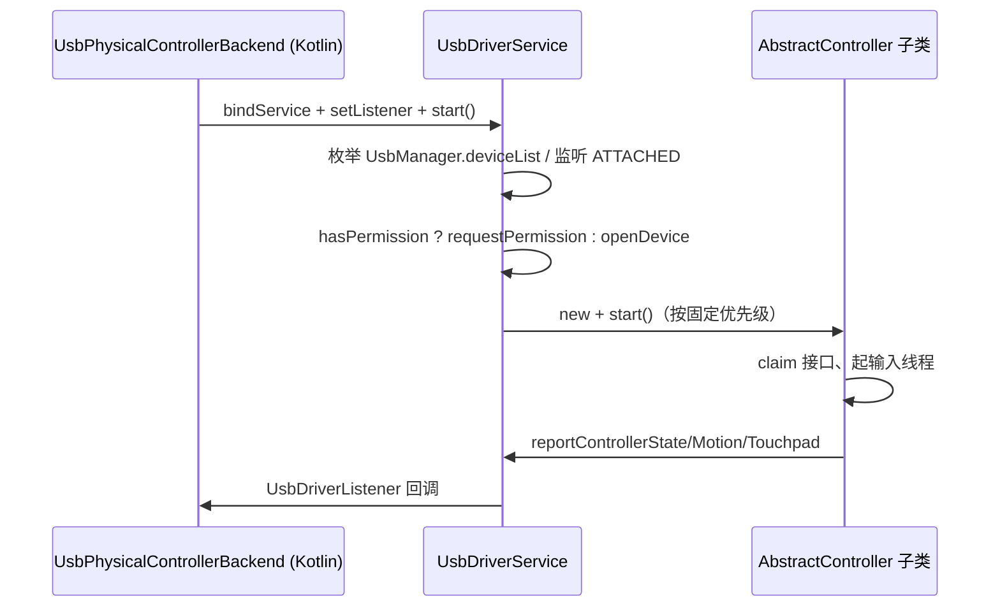

# USB 手柄驱动（input/usb）

> 覆盖 `android/src/main/java/com/zyz4/gkme/input/usb/*.java`（19 个文件）。
>
> 这一层是从 “Axixi2233 的 USB 驱动” 移植而来的手写 USB HID 驱动（`LimeLog` TAG = `Axixi2233Usb`），
> 按钮位布局对齐 Sunshine/Limelight。它是物理手柄两条后端之一（另一条为 SDL3，见 [input.md](input.md)）。
> Kotlin 侧对应 `input/UsbPhysicalControllerBackend.kt`。

---

## 1. 类层次与职责

```
AbstractController                      (抽象基类)
├── AbstractXboxController              (抽象，Xbox 通用 claim/线程骨架)
│   ├── Xbox360Controller               (Xbox360 有线)
│   └── XboxOneController               (Xbox One / One S / 兼容第三方)
├── AbstractDualSenseController         (抽象，PS 通用 claim/音频触觉/触摸板)
│   ├── DualSenseController             (PS5 DualSense / Edge / 雷蛇)
│   └── Dualshock4Controller            (PS4 DS4)
├── Xbox360WirelessDongle               (直接继承 AbstractController，仅发 LED)
├── ProConController                    (Switch Pro，0x057e:0x2009)
└── ProCon2Controller                   (Switch 2 Pro，0x057e:0x2069)

辅助/契约类：
ControllerPacket (按钮位常量)   GkmeBridge (类型/能力/动作常量)
UsbDriverListener (回调接口)    UsbDriverService.UsbDriverStateListener (权限状态)
DualSenseOutputReport  DualSenseHapticSender  HdRumbleCodec
HapticNative  LimeLog
```

要点：

- `Xbox360WirelessDongle` 是唯一**不**解析输入的控制器：只向 dongle 的多个接口发 LED 命令后主动返回
  `false`，让内核 xpad 保留设备。
- `Dualshock4Controller` 继承 `AbstractDualSenseController`，复用触摸板手指跟踪框架，但 DS4 无音频触觉端点，
  `hasAdvancedAudioHapticsSupport()` 恒为 false。

---

## 2. 总流程（UsbDriverService）

`UsbDriverService` 同时是 Android `Service`、`UsbDriverListener` 的实现者：从各 controller 收回调后
再透传给 Kotlin 客户端。



### 2.1 发现与 claim

1. **绑定/启动**：Kotlin 侧 `bindService`，拿到 `UsbDriverBinder` 后 `setListener(this)` + `start()`。
2. `start()`：注册 `ACTION_USB_DEVICE_ATTACHED` 与自定义 `com.zyz4.gkme.USB_PERMISSION` 广播；
   枚举设备并 `shouldClaimDevice`。
3. **热插拔**：`ATTACHED` 后延迟 1s 再处理，给内核 input 栈启动时间。
4. **权限**：无权限则 `requestPermission`；Android S+ 用 `FLAG_MUTABLE`；Android 14+ 用 `setPackage(...)`
   的显式 intent；捕获 Samsung Knox 的 `SecurityException`。
5. **打开并分派**：固定优先级
   `XboxOne → Xbox360 → Xbox360WirelessDongle → ProCon2 → ProCon → DualSense → Dualshock4`。
6. `controller.start()` 成功则加入 `controllers`；失败则关闭连接。

`canClaimDevice` 判据：

| 控制器 | VID | PID | 额外条件 |
|--------|-----|-----|----------|
| Xbox360 有线 | 多厂商白名单 | — | subclass 93 / protocol 1 |
| Xbox360 Dongle | `0x045e` | — | subclass 93 / protocol 129 |
| Xbox One | 多厂商白名单 | — | subclass 71 / protocol 208 |
| DualShock4 | `0x054C` | `0x05c4`, `0x09cc` | interfaceCount≥1 |
| DualSense | `0x054C`, `0x1532` | `0x0CE6`, `0x0DF2`, `0x100b`, `0x100c`, `0x0CF2` | interfaceCount≥1 |
| Switch Pro | `0x057e` | `0x2009` | 精确匹配 |
| Switch2 Pro | `0x057e` | `0x2069` | 精确匹配 |

### 2.2 读取与解析骨架

所有带输入的控制器共用同一骨架（以 `AbstractXboxController.createInputThread` 为模板）：

1. 线程启动先 `Thread.sleep(1000)`，等旧 `InputDevice` 消失。
2. `notifyDeviceAdded()` **先于**任何输入上报。
3. 循环 `connection.bulkTransfer(inEndpt, buffer, 64, 3000)` 阻塞读取。
4. `res==0` 归一为 `-1`；失败且距开始不足 1000ms 视为掉线并 `stop()`，否则视为超时重试。
5. `handleRead(ByteBuffer little-endian)` 返回 true 则 `reportInput()`。
6. `reportInput()` → `UsbDriverListener.reportControllerState`。

带输入的控制器 `stop()` 都会先 `rumble(0,0)` 消除残留震动，中断线程、release 接口、关闭连接、
`notifyDeviceRemoved()`。

> **易错点**：`Xbox360WirelessDongle.start()` 故意返回 `false`，因此它不入 `controllers`，
> `stop()` 不会被调用，连接由 `UsbDriverService` 在 start 失败分支关闭。

---

## 3. 各控制器解析/输出要点

### 3.1 Xbox360 有线（`Xbox360Controller.java`）

- 输入：跳过前 2 字节；字节 3 = DPAD/Start/Select/LS/RS；字节 4 = ABXY/LB/RB/Xbox；
  扳机 `unsignByte/255`；摇杆 `getShort/32767`，Y 轴 `~` 取反。
- 初始化：发 LED `{0x01,0x03, 2+(id%4)}`，失败不致命。
- 输出：rumble `{0x00,0x08,0x00, low>>8, high>>8,...}`；`rumbleTriggers` 空。
- 能力：`ANALOG_TRIGGERS | RUMBLE`。

### 3.2 Xbox360 无线 Dongle（`Xbox360WirelessDongle.java`）

- 不解析输入。遍历 `InputDevice` 找同 VID 设备取 `getControllerNumber()-1` 作为起始序号，
  再对每个匹配接口发 12 字节 LED 命令（发送时临时 claim/release 踢开内核 xpad）。
- `start()` 故意返回 `false`，属“副作用式”设备。

### 3.3 Xbox One（`XboxOneController.java`）

- 输入首字节 `0x20`：requiring remaining≥17，跳过 3 字节后 `processButtons`；
  首字节 `0x07`：mode report，One S 必须 ACK 否则无限重传；取 SPECIAL 位。
- 初始化 `INIT_PKTS` 表按 VID/PID 匹配，逐条把 `data[2]` 设为自增 `seqNum`。
- 输出 13 字节 `{0x09,0x00,seq,0x09,0x00,0x0F, lt>>9, rt>>9, low>>9, high>>9,0xFF,0x00,0xFF}`；
  额外声明 `LI_CCAP_TRIGGER_RUMBLE`。

### 3.4 DualShock4（`Dualshock4Controller.java`）

- 恰好 64 字节。DPAD=`get(5)&0x0F`；按钮在字节 5/6；PS=`get(7)&0x01`，TOUCHPAD=`get(7)&0x02`。
- 摇杆 `2*v/255-1`；扳机字节 8/9 除 255。
- IMU：`getShort(13/15/17)` 陀螺、`getShort(19/21/23)` 加速度；比例 `GYRO=2000/32768`、
  `ACCEL=4/32768*9.81`。
- 触摸板分辨率 **1920×920**。
- 初始化 32 字节 `[0]=0x05,[1]=0x02,[2]=0x04, RGB=0x78,0x78,0xEF`。
- 输出 rumble 32 字节 `[0]=0x05,[1]=0x01,[2]=0x04,[4]=high>>8,[5]=low>>8`。

### 3.5 DualSense（`DualSenseController.java`）

- 恰好 64 字节。DPAD/ABXY 在字节 8；LB/RB/Start/Select/LS/RS 在字节 9；
  PS=`get(10)&0x01`、MISC(截图)=`get(10)&0x04`、TOUCHPAD=`get(10)&0x02`。
- IMU：`getShort(16/18/20)` 陀螺、`getShort(22/24/26)` 加速度。
- 触摸板分辨率 **1920×1080**。
- 输出走 `DualSenseOutputReport`；`sendCommand` 在发带马达 flag 的报文后
  `invalidateAdvancedAudioHapticsPrime()`。
- 静态工具：`getTriggerEffectMode`、`setTrigger`（mode 1 阻尼 / 6 自动步枪 / 2 扳机）、
  `automaticTrigger/resistanceTrigger/normalTrigger/clearTrigger`。
- `onAdvancedAudioHapticsStarted()` 刻意留空——音频通路仅在 doInit 配置一次。

### 3.6 Switch Pro（`ProConController.java`）

- 初始化序列（输入线程内）：`handshake 0x02 → highSpeed 0x03 → handshake → loadStickCalibration →
  enableVibration(true) → setInputReportMode(0x30) → forceUSB 0x04 → setPlayerLED → enableIMU`。
- `sendCommand(id)` 发 `{0x80,id}` 等 `{0x81,id}`；`sendSubcommand` 组包并等回复。
- SPI flash 读 subcommand `0x10`；工厂/用户标定地址见代码；magic `0xB2A1`。
- 输入：`[0]==0x30`；ABXY 按 Nintendo 布局交换；12bit 摇杆；IMU `getShort(37..47)` 带符号 ÷16。
- 输出：普通 rumble `0x10` 10 字节；`hasHdRumbleSupport=true`，`setHdRumble` 用
  `HdRumbleCodec.writeClassicSide` 写左右经典 4 字节 side。

### 3.7 Switch 2 Pro（`ProCon2Controller.java`）

- bulk 端点在 interface id==1，HID 端点在有 `USB_CLASS_HID` 的接口。
- `USB_INIT_SEQUENCE` 10 个 `0x91` 命令；Flash 命令 `[0]=0x02,[1]=0x91`。
- 输入：字节 5 = ABXY/RB，字节 6 = Back/Play/RS/LS/Home/MISC/PADDLE1，字节 7 = DPAD/LB，
  字节 8 = PADDLE2/3；12bit 摇杆在字节 11-16。
- 传感器：`accelX@0x31, accelY@0x35, accelZ@-0x33`；`gyroX@0x37, gyroY@0x3b, gyroZ@-0x39`
  （轴定义与旧 Switch 不同）。
- HD rumble 走 `0x02` 包，`HdRumbleCodec.proCon2Freq/proCon2Amp`。
- 模拟 rumble 每 12ms 节流，频率固定 `0x0187/0x0112`，幅度上限 29000。

---

## 4. DualSense 自适应扳机与 HD 震动

### 4.1 DualSenseOutputReport（48 字节，`[0]=0x02`）

关键字段索引：`VALID_FLAG0=1`、`VALID_FLAG1=2`、`RIGHT_MOTOR=3`(高频)、`LEFT_MOTOR=4`(低频)、
音频 5/6/7/8/10、右扳机 type 11/data 12、左扳机 type 22/data 23、RGB 45/46/47。

flag 常量：`ENABLE_RUMBLE=0x03`、`ENABLE_RIGHT_TRIGGER=0x04`、`ENABLE_LEFT_TRIGGER=0x08`、
`ENABLE_AUDIO_CONFIGURATION=0xF0`、`ENABLE_INITIAL_EFFECTS=0xF7`、`ENABLE_LIGHTBAR=0x04`、
`ENABLE_PLAYER_INDICATOR=0x10`。

- `initialization()`：flag0=0xF0、flag1=0xF7，设音量/路由，RGB `0x78/0x78/0xEF`。
- `rumble()`、`adaptiveTriggers()`、`lightbar()`、`playerIndicator()`、`adaptiveTriggersFromLegacy()`。
- `compactFrame(...)`：把 rumble + 扳机 + lightbar + 玩家灯合并到单个 48 字节报文、一次 `bulkTransfer`。
  **音圈 PCM 流式播放时 `enableRumble=false`**，否则带马达 flag 的报文会切走音频触觉。

### 4.2 扳机缓存与 prime

`AbstractDualSenseController`：

- `updateAdvancedAudioHapticsTriggerCache(report)`：对 `report[0]==0x02` 且 flag0 置位对应
  `ENABLE_*_TRIGGER` 时缓存 type + 10 字节 data。
- `tryPrimeAdvancedAudioHaptics()`：构造 `[0]=0x02,[1]=0x0C,[2]=0x40` 并写回缓存扳机，成功则 `primed=true`。
- `invalidateAdvancedAudioHapticsPrime()`：携带马达 flag 的报文之后强制下次重 prime。

### 4.3 音频触觉端点与 native

- `detectHapticEndpoint()`：在 `USB_CLASS_AUDIO` 接口找 OUT、isochronous、`maxPacketSize==0x188(392)`
  的端点，找到后 `capabilities |= LI_CCAP_HAPTIC_PCM`。
- `startAdvancedAudioHaptics()`：取 fd 调 `HapticNative.nativeConnectHaptics(fd, ifaceId, altSetting, epAddr)`
  → `nativeEnableHaptics()` → 起 `DualSenseHapticSender`。
- `submitAdvancedAudioHapticsFrame(frame, gain)`：未 prime 先 prime，gain 限制 0..2.75。
- `submitNativeAudioHapticsFrame(frame)`：length ≤ 3920 且 `%8==0`。

### 4.4 DualSenseHapticSender

- 工作线程 `DualSense-Haptics`，`THREAD_PRIORITY_URGENT_AUDIO`。
- 队列容量 64；普通模式 `queue.take()`，出现 nativePcm 帧后进入 nativeMode，改用 `poll(10ms)`，
  空档发送 10ms 静音帧保持 isoc 端点不断流。
- **历史坑**：早期 1ms 轮询导致 isoc 管线过饱和、以 URGENT_AUDIO 饿死 OTG 上的 WiFi UDP 接收路径，
  已改为 10ms 节奏。

### 4.5 HdRumbleCodec（Nintendo HD rumble 线格式）

- `encodedFreq = round(log2(freq/10)*32)`，clamp 0..0xDF（`MAX_FREQ_HZ=1252`）。
- `encodedAmp` 分段 `log2` 编码。
- `writeClassicSide`：经典 4 字节 side；`proCon2Freq`/`proCon2Amp`：ProCon2 专用。

### 4.6 HapticNative / haptic_native.c

Java 声明 5 个 native 方法（`nativeConnectHaptics`、`nativeEnableHaptics`、`nativeSendHapticFeedback`、
`nativeSendNativeHapticPcm`、`nativeCleanupHaptics`），实现见 [haptic.md §native](haptic.md)。

---

## 5. 与 Kotlin 层的契约

1. **服务绑定**：Kotlin 实现 `UsbDriverListener`，通过 `UsbDriverBinder` 调 `setListener/start/stop/changeUSBFlag`。
2. **回调**（`UsbDriverListener.java`）：
   - `reportControllerState(controllerId, buttonFlags, lsx, lsy, rsx, rsy, lt, rt)`
   - `reportControllerMotion(controllerId, motionType, x, y, z)`
   - `reportControllerTouchpadEvent(controllerId, eventType, pointerId, x, y, pressure)`
   - `deviceAdded(AbstractController)` / `deviceRemoved(AbstractController)`
3. **Kotlin 反向调用**：`getControllerId/VendorId/ProductId/getCapabilities/getType`、`rumble`、
   `rumbleTriggers`、`setControllerLED`/`setPlayerIndicator`、`setAdaptiveTriggerEffects`、
   `setHdRumble`、`submitNativeAudioHapticsFrame`、`DualSenseOutputReport.compactFrame`。
4. **常量**：Kotlin 用 `GkmeBridge.LI_CCAP_*` / `LI_MOTION_TYPE_*` / `LI_TOUCH_EVENT_*` 判断。

`ControllerPacket` **不是报文对象**，而是按钮 bitmask 常量表；解析是直接写
`AbstractController.buttonFlags` 等字段，没有中间结构体。

---

## 6. 线程模型

- **每个控制器一个输入线程**：阻塞 `bulkTransfer`；统一“sleep(1000) → notifyDeviceAdded → 循环读”。
- **`DualSenseHapticSender` 独立线程** `DualSense-Haptics`。
- `UsbDriverService.UsbEventReceiver` 在主线程；`handleUsbDeviceState` 也在主线程。
- JNI 侧 `pthread_mutex_t g_haptic_mutex` 串行化 URB 提交与清理。

---

## 7. 关键常量

| 常量 | 值 | 位置 |
|------|----|------|
| 输入缓冲 | 64 字节 | AbstractXbox/AbstractDualSense |
| 读超时 | 3000ms（ProCon 1000） | 各控制器 |
| 掉线判定窗口 | 1000ms | 各控制器 |
| claim 后延迟上报 | 1000ms | 各控制器 |
| DualSense 音频端点 maxPkt | 0x188 = 392 | `AbstractDualSenseController` |
| prime 报文 | `[0]=0x02,[1]=0x0C,[2]=0x40` | `AbstractDualSenseController` |
| 音圈帧限制 | ≤3920 且 %8==0 | `AbstractDualSenseController` |
| HapticSender 队列/缓冲 | 64 / 4096 | `DualSenseHapticSender` |
| 静音帧 | 480×8=3840，10ms | `DualSenseHapticSender` |
| ProCon2 rumble 间隔/上限 | 12ms / 29000 | `ProCon2Controller` |
| 默认 DualSense 灯色 | `0x78/0x78/0xEF` | `DualSenseOutputReport` |

---

## 8. 已知问题 / 注意事项

| 问题 | 证据 |
|------|------|
| 重启不可用：`stopped=true` 后不复位，且 start 前不清空端点，二次 start 误报 duplicate endpoint | `AbstractXboxController.java:26,113-138,164`；`AbstractDualSenseController.java` |
| [已修复] DS4/DualSense `handleRead` 混用游标与绝对索引，游标实际无效 | `Dualshock4Controller.java:54-56` |
| [已修复] `ProConController.sendSubcommand` 重试语义有缺陷（`COMMAND_RETRIES=10` 形同虚设） | `ProConController.java:157-179` |
| [已修复] ProCon 普通 rumble 位运算优先级可疑（`&` 与 `>>`） | `ProConController.java:285-286` |
| HD rumble 与普通 rumble 共用 `0x10` 报文/计数器，非线程安全 | `ProConController.java:149-151,279-281,321-323` |
| 传感器轴定义三套实现各不相同，改动需谨慎 | DS4/DualSense vs ProCon vs ProCon2 |
| 触摸板分辨率不一致（DS4 1920×920 / DualSense 1920×1080 / Kotlin 1919×942） | 各控制器 |
| claim 策略差异：Xbox 跳过 AUDIO 接口，DualSense 强制 claim 全部（含音频） | `AbstractXboxController.java:108-111`；`AbstractDualSenseController.java:187-199` |
| 内核能力启发式基于 `os.version` 猜测，无法确认 xpad LED 配置 | `UsbDriverService.java:267-310` |
| Haptic 缓冲三层约束（4096 / 3920 / native 3920）需保持一致 | `DualSenseHapticSender.java:149`；`AbstractDualSenseController.java:367` |
| [已修复] touchpad `BUTTON_ONLY` 事件也更新坐标并分配 slot | `UsbPhysicalControllerBackend.kt:255-273` |

---

## 9. 相关文档

- 后端抽象与切换：[input.md](input.md)
- DualSense 音频触觉 native 实现：[haptic.md](haptic.md)
- 虚拟手柄（uhid 路径）的 HID 描述符：[controlled-native.md](controlled-native.md)
