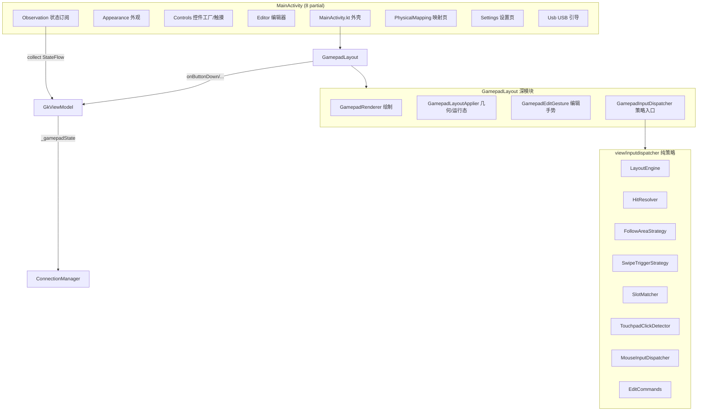

# UI 与视图层（view / MainActivity / GkViewModel）

> 覆盖 `MainActivity*.kt`（8 个 partial）、`GkViewModel.kt`、`FloatingModeController.kt`、`CustomDialog.kt`、
> `GkmeApp.kt` 与 `view/`、`view/inputdispatcher/` 全部文件。
>
> UI 层是 MVVM + 自定义 ViewGroup + 纯函数策略层的组合。状态收敛在 `GkViewModel` + `AppSettings`，
> 布局/绘制/命中收敛在 `GamepadLayout` 与它的 4 个深模块。

---

## 1. 总体结构

---

## 2. MainActivity 各 partial

`MainActivity.kt` 是同一个 class 的多个 Kotlin partial 扩展函数文件。

### 2.1 MainActivity.kt（外壳、生命周期、悬浮、屏幕关闭、触觉、按键分发）

- `onCreate`：`setContentView` → 取 `gamepadLayout` → 构造 `FloatingModeController`、
  `PhysicalControllerHandler` → `GamepadInjector.init` / `HapticInjector.init` → `setupMediaSession`
  （音量键）→ `setupGamepadLayoutListener` → 延迟 500ms `ensureSettingsInflated()` → `observeState()`
  → `autoStartService()` → SDL 初始化 → `physicalControllerHandler.start()`。
- 返回优先级：屏幕关闭 → 预览放大 → 曲线放大 → 布局全局设置 → 全局设置 → 编辑模式确认 → 设置页。
- 悬浮模式：`enterFloatingMode` / `continueEnterFloating` / `startFloatingMode` / `exitFloatingMode`；
  自动悬浮 `onUserLeaveHint → maybeAutoEnterFloating`（仅 LOCAL 且服务已启动、非编辑、已有悬浮权限）。
- 屏幕关闭模式：`enterScreenOffMode` / `exitScreenOffMode`（`R.id.screenOffOverlay` 纯黑 + KEEP_SCREEN_ON）。
- 物理手柄桥接：`dispatchKeyEvent` / `onKeyDown` / `onKeyUp`（含音量键映射）、
  `dispatchGenericMotionEvent`、`dispatchTouchEvent`（仅 Sony vendorId `0x054c` 走手柄分发）、
  `syncPhysicalControllerState`。
- 触觉：`performHaptic`（VIEW 走 RichTap 预置效果，VIBRATION_EFFECT 走 `PhoneHdHaptics`）、
  `vibratePhoneForAdaptive`。
- 外观去重：`applyAppearanceIfChanged` 用 `lastAppliedSettings` 避免重复全树 restyle。
- Chip 组与音量映射 UI：`selectChipGroup`、`updateVolumeBits`、`populateVolumeMapping` 等。

### 2.2 MainActivityAppearance.kt（外观页）

- 图片选择：`setupAppearanceImageLaunchers` / `savePickedImage`（缩放压缩 JPEG 到 `filesDir/appearance_images`）。
- 变更入口：`onAppearanceChange` → `viewModel.updateAppearance` → `applyAppearanceIfChanged` → 同步 UI。
- `setupAppearancePage` 绑定背景/按钮/摇杆/触发区/触摸板/一体十字键的填充类型、颜色、描边、图片。
- 颜色选择：`showColorPickerDialog`（HSV + HEX + “使用控制 LED 颜色”）、`showAppearanceColorPicker`。
- 预览：`renderAppearancePreview`（直接把 `gamepadLayout.draw(canvas)` 画到 Bitmap）、`showPreviewZoom`。
- 导入导出：`exportAppearanceToUri`（JSON + 图片打 ZIP）、`importAppearanceFromUri`。

### 2.3 MainActivityControls.kt（控件常量、触摸处理、鼠标/触摸板手势、标签）

- `Kb`：HID keyboard scan code 常量表；`BitNameMapper`：bit ↔ 中文名、键盘上档字符。
- `CtrlEntry` / `allControls`：所有可添加控件的元数据。
- `setupGamepadLayoutListener`：接 `GamepadLayoutListener`，处理选中态、编辑模式、触摸板事件、
  指针捕获与鼠标报文。
- 视图工厂与触摸：`createSettingsButtonView`、`setupTouchHandler`（`ButtonTracker` 手势状态机）、
  `createDpadPadView/setupDpadPadTouch`、`createCustomKeypadView/setupCustomKeypadTouch`、
  `setupTouchpadView`（10 槽多点跟踪、单击/双击、旋转与扩展区域）、`setupMousepadView` /
  `attachMousepadGestures`（完整鼠标手势）。
- 鼠标报文：`moveRaw`（加速度 + 旋转补偿 + 累积小数 + 16 位有符号）、`doScroll`
  （WIFI/USB 用 33f 高精度，蓝牙用 1f）、`sendMouseReportDirect`。
- 标签刷新：`updateButtonLabels`（XBOX/PS/SWITCH）、`updateKeyboardLabels`（Shift 上档）。

### 2.4 MainActivityEditor.kt（浮动编辑器、全局设置、添加控件、视图重建）

- `createFloatingEditor`：懒加载 `FloatingEditorPanel`，实现 `EditorListener`，挂到 `android.R.id.content`
  （宽 40% 高 80%）。
- `showLayoutGlobalSettings` / `hideLayoutGlobalSettings`：全屏 `LayoutGlobalSettingsPanel`。
- 曲线放大：`showCurveZoom` / `hideCurveZoom`。
- `showAddButtonDialog`（4 个 Tab：手柄/鼠标/键盘/自定义）。
- `addControl`：按 `CtrlEntry` 创建 View、寻找不重叠网格位置、addView + 绑定触摸。
- `ensureViewsForAllPresetButtons`：**整树重建**所有按钮视图（含 settings 按钮），重算 `addCounter`。
- `createStandardControlView`、`showOutputValuePicker`（负值 = 键盘 scan code）、`recreateViewForButton`。

### 2.5 MainActivityObservation.kt（状态订阅）

`observeState` 在 `repeatOnLifecycle(STARTED)` 中并发收集：

- `connectionState`：状态文字、服务按钮、WIFI IP、断连时 `stopAllVibration`、清 trigger effect。
- `displayMode` / `keyboardShiftActive`。
- `settings`：KEEP_SCREEN_ON、swap motor、input controller index、driver、物理手柄设置、外观。
- `currentPreset`：`applyLayoutGyroSettings`，非编辑模式 `applyPreset`。
- `_gamepadState`：把 buttons 与 `ctrlEntryBitMap` 同步给 `GamepadLayout`，驱动 `AdaptiveTriggerHandler`。
- `ledState`：透传 LED 到实体手柄 + `applyLedColorToAppearance` + `syncAppearanceUI`。
- `physicalControllerHandler` 的 `isConnected`/`connectedControllers`/`controllerState`/`activeDriver`/`gyroData`。

### 2.6 MainActivityPhysicalMapping.kt（实体手柄重映射页）

- `currentSupportedPhysicalButtons`：当前手柄支持掩码，无手柄回退 `STANDARD_BUTTON_MASK`。
- `writePhysicalMapping`：默认值不落盘（从 map 移除）。
- `populatePhysicalMapping` / `buildPhysicalMappingRow` / `fillPhysicalMappingChips`。

### 2.7 MainActivitySettings.kt（设置页，最大 partial）

- `SETTINGS_PAGES` / `SETTINGS_CATEGORY_BUTTONS`（9 个分类）。
- 惰性 inflate：`ensureSettingsInflated`（`ViewStub`）；`showSettings`/`hideSettings` 用圆形揭示
  `ViewAnimationUtils.createCircularReveal`。
- `selectSettingsCategory`：页面位移动画 + 侧边栏高亮；第 2 页触发外观预览，第 4 页启动震动 UI 轮询，
  第 6 页启动音频指示轮询。
- `setupSettings` 绑定各页；大量 `sync*`/`build*` 辅助。
- 本机模式（Shizuku）：`startLocalMode` / `tryStartLocalVirtualDevice`（rumble=false、mouse=false）/
  `startShizukuPolling`。
- 预设管理：`refreshPresetList` + `PresetGridAdapter`、新建/导入/导出/重命名/复制。
- 连接页 `setupConnectionPage`：启动/停止服务、蓝牙权限、USB adb 检查、轮询率选项
  `[30,45,60,90,100,120,200,250,300,500,750,1000]`。

### 2.8 MainActivityUsb.kt（USB/adb 引导）

- `isUsbDebuggingEnabled`（读 `Settings.Global.ADB_ENABLED`）、`checkUsbAdbAndStart`、
  `showUsbAdbGuideDialog`、`openDeveloperOptions`。

---

## 3. GkViewModel

`GkViewModel @Inject constructor(connectionManager, layoutRepository, app)`，继承 `AndroidViewModel`。
是唯一 UI 状态中枢。

### 3.1 主要 StateFlow

| 状态 | 说明 |
|------|------|
| `connectionState` | 来自 `ConnectionManager` |
| `settings` | `AppSettings` 唯一持久化源 |
| `ledState` / `pairedDeviceName` | LED / 蓝牙配对 |
| `_gamepadState` / `gamepadState` | 最终上报的 `GamepadState` |
| `_displayMode` / `displayMode` | XBOX / PS / SWITCH |
| `_currentPreset` / `currentPreset` | 当前 `LayoutPreset` |
| `_presetInfos` / `presetInfos` | 预设列表 |
| `_gyroDisplay` / `gyroDisplay` | 实时陀螺读数 |
| `_physicalControllerConnected` | 实体手柄连接标志 |
| `_gyroOverrideEnabled` | 按钮激活陀螺仪的覆盖开关 |
| `_keyboardShiftActive` | Shift 状态（键盘标签上档） |

### 3.2 主要方法

- 初始化：`init`（同步 displayMode、`initializeLayouts`、启动传感器显示、LED 绑定同步）、
  `refreshPresetList`。
- 预设：`loadPreset` / `savePreset` / `saveCurrentPreset` / `deletePreset` / `renamePreset` /
  `updatePresetButtons` / `applyLayoutGyroSettings`。
- 设置：一长串 `updateXxx` → `connectionManager.updateSettings(copy(...))`。
- 陀螺仪：`updateGyroMode/Orientation/BaseDirection/CoordinateSystem/ModeSensitivity/DeadZone/
  ReverseDeadZone/StickCurve/ActivateMode`、`onGyroActivateButtonDown/Up`、`onPhysicalControllerGyro`。
- 输入上报核心：
  - `onPhysicalControllerInput`：合并手机端与物理端、应用映射、合并鼠标键位、计算 hat、写 `_gamepadState`。
  - `applyPhysicalMappings`。
  - `onButtonDown/Up`、`onMouseGestureButton`、`onCustomButtonDown/Up`、`onVolumeKeyDown/Up`。
  - `onLeftStick/onRightStick`、`onDpad`、`updateDpad`、`onLeftTrigger/onRightTrigger`。
  - 键盘：`onKeyDown/onKeyUp`、`updateKeyboardShiftState`、`sendKeyboardReport`。
  - 触摸板：`onTouchpadTouches`。
- 服务与发送循环：`startServer`（注册 `onMouseReport`）、`startPeriodicSendLoop`（`:852`）、
  `startSensorSendLoop`（`:939`）、`stopServer`。
- 外观 LED：`applyLedColorToAppearance`（`lastAppliedLedColor` 去重）。

### 3.3 与 Activity 的交互

Activity **不直接改 ViewModel 内部状态**：

1. Activity 调 `updateXxx`（写 settings）或输入方法；
2. `observeState` 用 `repeatOnLifecycle` 订阅 `StateFlow`，把状态映射回 View；
3. `FloatingModeController.startObservers` 在 Activity 停止后继续订阅，保证悬浮窗仍刷新。

---

## 4. GamepadLayout：解析、绘制、命中

### 4.1 网格与布局

- 固定 **120 列网格**（`GRID_COLS=120`）；`onLayout` 中 `cellW = width / 120f`、`cellH = cellW`。
- `ButtonPosition` 以网格坐标 `x/y/width/height` 存储；旋转 90/270 且 `!lockAspect` 时交换屏幕宽高。
- `loadPreset`：旧 `centerArea` 迁移为 `touchpad`；缺设置按钮自动补顶部中间 6×6 的 `btnSettings`；
  `sanitizeSettingsButton`（禁止旋转/滑动触发、强制重叠触发、钳制屏幕内）；`normalizeTouchpadArea`。
- 子 View measure/layout 委托 `GamepadLayoutApplier.applyLayout`：
  visibility、`measure(EXACTLY)` + `layout`、旋转（Joystick 用 `axisRotation` 等）、
  透明度（编辑模式恒 1；运行时按 `ctrlEntryBitMap` + pressed bits 选 idle/active opacity）、
  以及 Joystick/DpadPad/CustomKeypad 的特殊属性。

### 4.2 绘制

- `GamepadLayout.onDraw` 只调 `GamepadRenderer.render`：
  - follow-area / touchpad-area / dpadPad-area 描边矩形；
  - `LinearTriggerView` 行程线框；
  - 编辑模式网格；
  - 选中框 + resize handle + 旋转方向标记。
- 各控件外观由自身 `onDraw`：`JoystickView`（含死区黄环、反死区蓝环）、`DpadPadView`（9 区域）、
  `CustomKeypadView`（4/8 方向楔形或 3×3）。

### 4.3 运行时触摸分发与命中

`GamepadLayout.dispatchTouchEvent`：

- **编辑模式**：直接转 `onTouchEvent`，绕过子 View（`onInterceptTouchEvent` 返回 `isEditMode`）。
- **运行模式**：有 swipeTrigger 控件走 `handleSwipeTriggerTouch`；否则 `pointerDown` 记录并分发。
- 命中检测核心在 `GamepadLayoutGeometry`：`findAllChildrenAt` 用**网格坐标**而非 view bounds；
  `filterOverlapChildren` 过滤 `overlapTrigger=false`；settings 按钮永远优先。
- 触摸板/鼠标板按 id 特殊路由，用 `GamepadTouchDispatchUtils.dispatchFilteredToTouchpad` 只派发属于该控件的 pointer。
- 扩展跟随区（follow-area）：`GamepadFollowAreaTrigger` 命中后设子控件 `forceFollowFinger=true`。

### 4.4 编辑机制

- `enterEditMode` 保存 `editSnapshot`；`exitEditMode`；`discardToSnapshot`。
- `onTouchEvent`（编辑）→ `GamepadEditGesture.dispatch` → `GamepadInputDispatcher.dispatchEdit`。
- 命令是纯数据 `EditCommand`：`MoveButton`、`ResizeButton`、`MoveFollowArea`、`ResizeFollowArea`；
  `applyTo` 返回新列表，无副作用。
- 未选中按钮拖动有 3 格死区，避免误触。
- settings 按钮置顶用 `translationZ`（Material elevation 会导致 `bringChildToFront` 无效）。

---

## 5. 浮动编辑面板系列

| 视图 | 职责 |
|------|------|
| `view/FloatingEditorPanel.kt` | 参数编辑面板，可拖动/折叠，参数区切换动画 |
| `view/LayoutGlobalSettingsPanel.kt` | 全屏布局级全局设置（陀螺仪/实体手柄/音量键 3 Tab） |
| `view/CurveEditorView.kt` / `CurveZoomOverlay.kt` | 灵敏度曲线编辑与放大 |
| `view/ColorPickerView.kt` | HSV 取色 |
| `view/PresetPreviewView.kt` | 预设图形预览 |

`FloatingEditorPanel.populateParameterViews` 按控件类型构建参数：通用尺寸/旋转/透明度/重叠/陀螺激活/
自动保持；摇杆矩形跟随、死区/反死区、灵敏度曲线；触摸板扩展范围；鼠标板 7 个手势动作 +
灵敏度/滑动判定/滚动灵敏度/指针加速度/滚动反转；`dpadPad`/`customKeypad` 中心形状、方向模式、
每区域文本与映射；自定义按钮文本 + 映射键值。

数值编辑统一封装 `addSeekbar` / `addSeekbarFloat`（输入框 + / - 按钮 + SeekBar，且
`requestDisallowInterceptTouchEvent`）。

---

## 6. view/inputdispatcher 策略层

该子包是零 Android 依赖（除 `ViewExtensions` 适配器）的纯策略层，边界数据为 `RawTouchEvent`。

### 6.1 边界类型（InputDispatcher.kt）

`RawTouchEvent`、`Pointer`、`InteractionResult`、`FollowAreaAction`、`SlotAssignment`、
`OldSlotState`、`TouchCandidate`、`ClickResult`、`SwipeResult`、`FollowAreaResult`、`LayoutResult`、
`EditModeState`、`FollowAreaDragStart`/`ResizeStart`、`ChildDragStart`/`ResizeStart`、`EditDispatchResult`；
接口 `InputDispatcher.dispatchInteraction` / `dispatchEdit`。

`ViewExtensions.toRawEvent` 是唯一把 `MotionEvent` 转 `RawTouchEvent` 的适配器。

### 6.2 组合根 GamepadInputDispatcher

构造时注入 6 个策略：`LayoutEngine`、`HitResolver`、`FollowAreaStrategy`、`SwipeTriggerStrategy`、
`SlotMatcher`、`TouchpadClickDetector`。

- **Run mode `dispatchInteraction`**：UP/CANCEL 释放全部 swipe 并清空 slot；
  `SlotMatcher.buildCandidates`（像素除以硬编码 1920/942 归一化）+ `assign`（最近邻分配 slot0/slot1）；
  `TouchpadClickDetector.detect`（XOR 求 primary/secondary 边沿）；
  swipe 模式用 `SwipeTriggerStrategy`，否则用 `FollowAreaStrategy`。
- **Edit mode `dispatchEdit`**：见 §4.4。

### 6.3 命中解析

- `HitResolver.findAllChildrenAt`（矩形判定）/ `filterOverlapChildren` / `resolve`。
- `GamepadLayoutGeometry` 提供网格坐标版，入口不同但逻辑一致。

### 6.4 MouseInputDispatcher

鼠标模式手势状态机：

| 手势 | 动作 |
|------|------|
| 单指移动 | 光标 |
| 双指移动 | 滚动 |
| 单指轻点 | 左键 |
| 双指轻点 | 右键 |
| 三指轻点 | 中键 |
| 三指拖拽 | 按住中键移动 |
| 双击后拖拽 | 按住左键 |

- `TAP_TIMEOUT=200ms`；`computeTwoFingerScroll` 用双指历史坐标均值差。

---

## 7. 外观

### 7.1 AppearanceApplier

`view/AppearanceApplier.kt`。入口 `applyToGamepadLayout`：背景（纯色/图片）→ 扩展区域描边 →
遍历子 View 分派。

- `applyToButton`：前景内容、图标上限（`CappedContentDrawable`）、文本上限（`applyContentTextCap`）、
  自适应 padding（`min(w,h)×10%`）、填充（纯色/图片，均用 `StateListDrawable` 区分 pressed/normal）。
- 摇杆 / 一体十字键 / 自定义按键盘 / 触摸板 各自的外观。
- `CappedContentDrawable`、`LetterIconDrawable`（LS/RS 三角 + 字母）。
- 文本“无限”上限 `UNLIMITED_TEXT_CAP_PX=8192`。

### 7.2 LED 绑定

链路：`ledState` → `physicalControllerHandler.setLedColor` + `viewModel.applyLedColorToAppearance`
→ `LedAppearance.applyLedColor` 写所有 `ledBoundColors` 字段 → `syncAppearanceUI`。

- `LedAppearance.clamp` 把绑定色钳制到最低亮度 `#1A1A1A`。
- 默认绑定 `tpOutlineColor`。
- 颜色选择框勾选“使用控制 LED 颜色”即绑定，取消即解绑。

---

## 8. FloatingModeController（悬浮窗）

`FloatingModeController.kt`。把 `GamepadLayout` 从 Activity 重新 parent 到 `WindowManager` overlay。

- `enter()`：注册 DisplayListener，创建隐藏态 toggle 窗口（眼睛图标，可拖动），启动 observers。
- `showControls()`：把 `gamepadLayout` 移入 overlay `FrameLayout`；竖屏旋转 90°；`alpha=floatingOpacity`；
  临时把 gamepad 背景置 null；`TYPE_APPLICATION_OVERLAY` +
  `FLAG_NOT_FOCUSABLE | FLAG_LAYOUT_IN_SCREEN | FLAG_LAYOUT_NO_LIMITS`；添加失败会回滚。
- `hideControls()`：恢复 alpha、移除 overlay、`attachGamepadToActivity` 还原、恢复背景与设置按钮。
- `exit()`：移除 toggle、恢复、注销监听。
- 方向变化 `onOrientationChanged`：显示中重建尺寸/变换，隐藏中重定位 toggle。
- observers 在 Activity 停止后继续订阅 `_gamepadState`、`settings`、`displayMode`、`keyboardShiftActive`。
- 与 Activity 交互：`FloatingOverlayService` 前台服务 + `enter()` + `moveTaskToBack`；
  `FLOATING_RESUME_GUARD_MS=2000` 防止刚进入就退出。

---

## 9. 关键常量

| 常量 | 值 | 位置 |
|------|----|------|
| 网格列数 | 120 | `GamepadLayout.kt`、`LayoutEngine.kt`、`FloatingModeController.kt` |
| settings 按钮 id | `"btnSettings"` | `GamepadLayout.kt`；`EditCommands.kt` |
| 编辑手柄 | `HANDLE_SIZE_DP=8`、`HANDLE_HIT_DP=16` | `GamepadLayout.kt` |
| 触摸板归一化坐标 | x 0..1919、y 0..942 | `MainActivityControls.kt`；`SlotMatcher.kt`（1920/942） |
| 悬浮 resume 保护 | 2000ms | `MainActivity.kt` |
| 鼠标 tap 超时 | 200ms | `MouseInputDispatcher.kt` |
| 物理扳机按下阈值 | 128 | `GkViewModel.kt` |
| 物理摇杆陀螺激活阈值 | 8000 | `GkViewModel.kt` |
| 陀螺满量程角速度 | 5 rad/s | `GkViewModel.kt` |
| 文本“无限”上限 | 8192px | `AppearanceApplier.kt` |

---

## 10. 已知问题 / 注意事项

| 问题 | 证据 |
|------|------|
| 设置页惰性 inflation，观察者必须在 `settingsInflated` 为 false 时跳过 UI 更新 | `MainActivitySettings.kt:113` |
| `MouseInputDispatcher` 的 `ACTION_POINTER_DOWN` 未右移 `ACTION_POINTER_INDEX_SHIFT` 就当索引 | `MouseInputDispatcher.kt:91-95` |
| `MouseInputDispatcher` 拖拽判定要求 dx、dy 同时非零，可能漏纯水平/垂直拖动 | `MouseInputDispatcher.kt:129` |
| `SlotMatcher` 硬编码 1920/942，与调用方 1919/942 差 1px | `SlotMatcher.kt:97` |
| `FollowAreaStrategy` 重叠/非重叠分支完全相同 | `FollowAreaStrategy.kt:43-56` |
| `SwipeTriggerStrategy` 的 overlapTrigger 分支为空 | `SwipeTriggerStrategy.kt:46-52` |
| settings 按钮置顶必须用 `translationZ`，`bringChildToFront` 会被 elevation 抵消 | `GamepadLayout.kt:850-867` |
| 编辑模式必须整树重建，否则 `applyPreset` 堆叠重复 settings 按钮 | `MainActivityEditor.kt:924-944` |
| 鼠标键位需取并集，避免“按住屏幕按钮再点鼠标板把它松开” | `GkViewModel.kt:1005-1006,1272-1275` |
| 悬浮/本机模式特殊处理：本机 rumble=false、mouse=false | `MainActivitySettings.kt:1666-1668` |
| Shizuku 授权只自动尝试一次，拒绝后停止轮询 | `MainActivitySettings.kt:1670-1676` |
| 全 UI 层无 `TODO/FIXME`，注意事项以散文注释形式存在 | — |

---

## 11. 相关文档

- 输入如何流向网络：[input.md](input.md)、[service-transport.md](service-transport.md)
- 布局 JSON 持久化：[model-data.md](model-data.md)
- 自适应扳机与触觉：[haptic.md](haptic.md)
